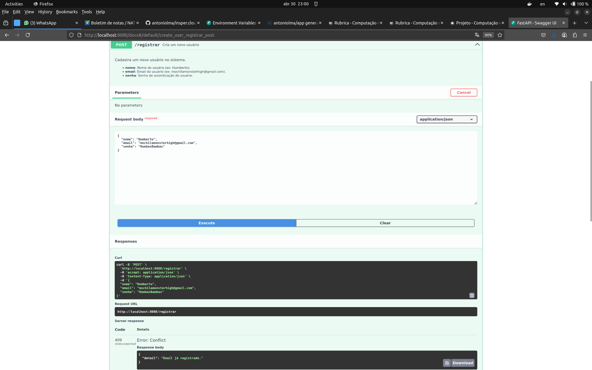
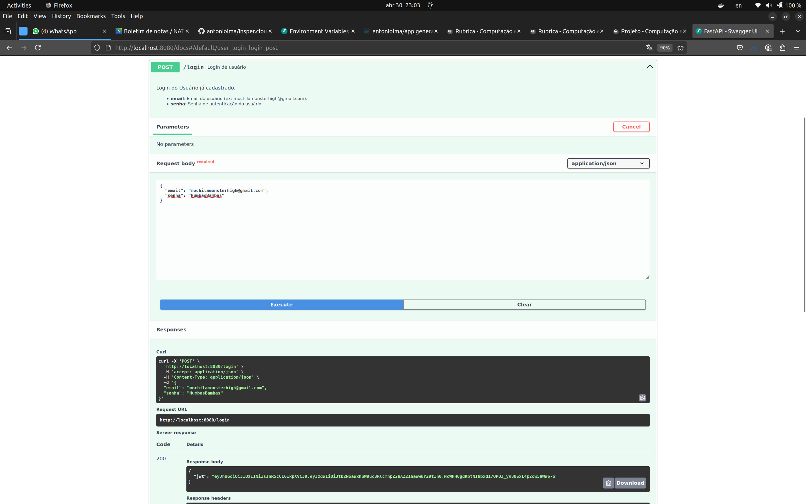

# **Projeto 2025.1**

<p align="justify">
O projeto consiste na construção e desenvolvimento de uma <b>API RESTful</b> para <b>cadastro</b> e <b>autenticação</b> de usuários, utilizando ferramentas do framework <b>FastAPI</b>
</p>

<p align="justify">
Após a construção da API, o projeto deve ser <b>dockerizado</b>, publicado no <b>Docker Hub</b> e, por fim, implantado no <b>AWS</b>.
</p>

<p align="justify">
Para uma melhor organização do projeto, ele foi dividido em três entregas.
</p>

## **Objetivo da Avaliação**

<p align="justify">
Avaliar o domínio dos alunos em:
</p>

<ul>
    <li>Containerização local com Docker Compose</li>
    <li>Deploy em ambiente de nuvem com AWS Lightsail</li>
    <li>Conexão segura com banco de dados</li>
    <li>Estruturação de aplicação web com FastAPI</li>
    <li>Boas práticas de código, documentação e custo</li>
</ul>

## Entrega 1

### Construção da API
<p align="justify">
Este projeto consiste em desenvolver uma <b>API RESTful</b> em <b>FastAPI</b>, com três endpoints básicos:
</p>

<ul>
    <li>
        <b>POST /registrar</b>: Usuário entra com <code>nome</code>, <code>email</code> e <code>senha</code>.
        <ul>
            <li><b>Código 200</b>: (Sucesso) <code>email</code> não encontrado na base de dados, faz o registro de um novo usuário, com senha codificada em formato <code>HASH</code>, e retorna o <b>JWT Token.</b></li>
            <li><b>Código 409</b>: (Error) <code>email</code> já se enconta cadastrado, cancela operação.</li>
        </ul>
    </li>
    <li>
        <b>POST /login</b>: Usuário entra com <code>email</code> e <code>senha</code>.
        <ul>
            <li><b>Código 200</b>: (Sucesso) Conta associada ao <code>email</code> é encontrada e a <code>senha</code> recebida bate com a senha codificada no banco de dados, faz o login do usuário e retorna o <b>JWT Token.</b>.</li>
            <li><b>Código 401</b>: (Error) <code>email</code> recebido não é encontrado na base de dados</li>
            <li><b>Código 401</b>: (Error) <code>senha</code> não confere com a senha codificada na base</li>
        </ul>
    </li>   
    <li>
        <b>GET /consultar</b>: 
        <p>AAAAAAAAAAAAaaaaaaaaaaaaaaaaaaAAAAAAAAAAAAAAaaaaaaaAAAAAaaaaaAAAaaaaAAAAaaaAAAAaaAAAAAAAAAAAAAAAAAA</p>
    </li>
</ul>


/// caption
Documentação dos endpoints da API
///

<p align="justify">
Após a implementação de cada um dos endpoints, tratando cada caso possível mencionado anteriormente, e integração com o banco de dados <b>PostgreSQL</b>, é necessário testar os endpoints para passar para a próxima etapa.
</p>

<figure>
  <iframe
    width="960"
    height="540"
    src="https://www.youtube.com/embed/wQ80j4tuGUE"
    title="Vídeo testando API"
    frameborder="0"
    allow="accelerometer; autoplay; clipboard-write; encrypted-media; gyroscope; picture-in-picture"
    allowfullscreen
  ></iframe>
  <figcaption>Vídeo mostrando funcionalidades da API (Testes)</figcaption>
</figure>


/// caption
Teste do endpoint "/registrar" (Success: Cadastro realizado)
///


/// caption
Teste do endpoint "/registrar" (Fail: Email já registrado)
///


/// caption
Teste do endpoint "/login" (Success: Login bem-sucedido)
///


/// caption
Teste do endpoint "/login" (Fail: Email não registrado)
///


/// caption
Teste do endpoint "/login" (Fail: Senha incorreta)
///


/// caption
Teste do endpoint "/consultar" (Success: [Retorna cotação Dolar e Euro])
///


/// caption
Teste do endpoint "/consultar" (Fail: JWT ausente ou inválido)
///

### Dockerizing

<p align="justify">
Com o código da <b>API</b> pronto, a próxima etapa é <b>dockerizar</b>/<b>containerizar</b> dos 2 serviços juntos: a aplicação e o banco de dados. Dentro do docker, é necessário a criação de um arquivo <code>Dockerfile</code> (de acordo com a linguagem e ambiente de execução escolhidos) e <code>compose.yaml</code> para a execução da aplicação, sendo capaz de se conectar ao banco de dados e realizar as operações de CRUD. 
</p>

<p align="justify">
Não só isso, mas a aplicação deve ser autocontida, ou seja, deve ser possível executar a aplicação apenas com o comando <code>docker compose up</code>.
</p>

<p align="justify">
Ao final da Dockerização, a saída desse comando devolve:
</p>

``` bash 
> docker compose up -d
[+] Running 2/2
 ✔ Container inspercloud-projeto-db-1   Running
 ✔ Container inspercloud-projeto-app-1  Running  

> docker compose ps
NAME                        IMAGE                   SERVICE   STATUS         PORTS
inspercloud-projeto-app-1   antoniolma/app:v1.0.1   app       Up 3 seconds   0.0.0.0:8080->80/tcp
inspercloud-projeto-db-1    postgres:17             db        Up 8 seconds   0.0.0.0:5432->5432/tcp
```

<p align="justify">
A organização do diretório ao final do projeto:
</p>

``` bash 
├── api/                    # contexto de build da sua aplicação
│   ├── Dockerfile          # Dockerfile que instala dependências e copia api/app/
│   ├── requirements.txt    # lista de pacotes Python
│   └── app/                # código-fonte FastAPI
│       ├── app.py
│       └── models.py
├── .env                    # variáveis de ambiente (POSTGRES_*, DATABASE_URL, SECRET_KEY…)
└── docker-compose.yml      # orquestração dos serviços db + app
```

<p align="justify">
Para subir o container no Docker Hub, foi utilizado os seguintes comandos:
</p>

<ol>
    <li> Login no Docker Hub:
    ```bash
    docker login
    ```
    </li>
    <li> Login no Docker Hub:
    ```bash
    docker login
    ```
    </li>
</ol>