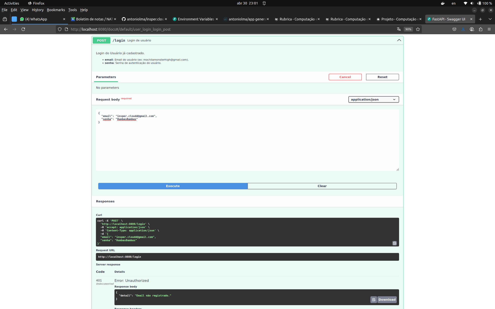
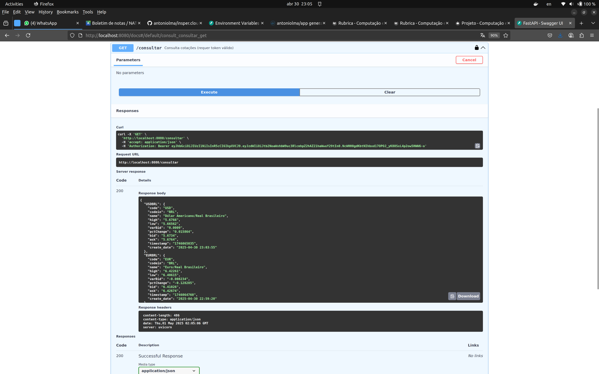
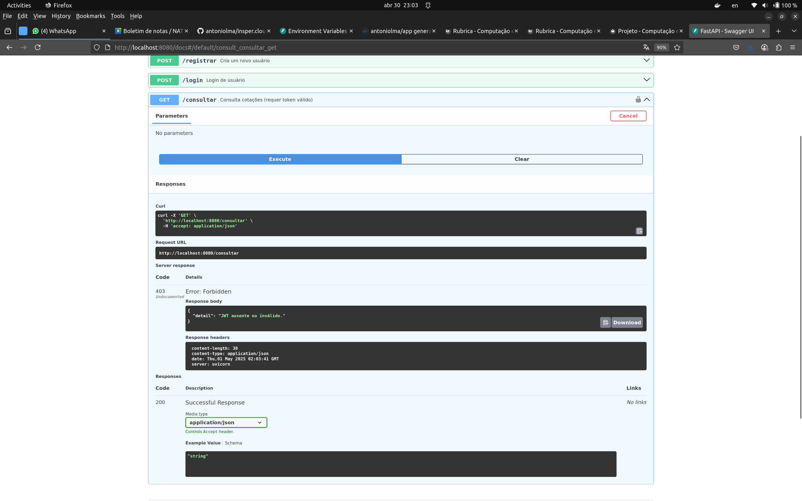

# **Projeto 2025.1**

<p align="justify">
O projeto consiste na construção e desenvolvimento de uma <b>API RESTful</b> para <b>cadastro</b> e <b>autenticação</b> de usuários, utilizando ferramentas do framework <b>FastAPI</b>
</p>

<p align="justify">
Após a construção da API, o projeto deve ser <b>dockerizado</b>, publicado no <b>Docker Hub</b> e, por fim, implantado no <b>AWS</b>.
</p>

<p align="justify">
Para uma melhor organização do projeto, ele foi dividido em três entregas.
</p>

## **Objetivo da Avaliação**

<p align="justify">
Avaliar o domínio dos alunos em:
</p>

<ul>
    <li>Containerização local com Docker Compose</li>
    <li>Deploy em ambiente de nuvem com AWS Lightsail</li>
    <li>Conexão segura com banco de dados</li>
    <li>Estruturação de aplicação web com FastAPI</li>
    <li>Boas práticas de código, documentação e custo</li>
</ul>
----

## Entrega 1

### Construção da API
<p align="justify">
Este projeto consiste em desenvolver uma <b>API RESTful</b> em <b>FastAPI</b>, com três endpoints básicos:
</p>

<ul>
    <li>
        <b>POST /registrar</b>: Usuário entra com <code>nome</code>, <code>email</code> e <code>senha</code>.
        <ul>
            <li><b>Código 200</b>: (Sucesso) <code>email</code> não encontrado na base de dados, faz o registro de um novo usuário, com senha codificada em formato <code>HASH</code>, e retorna o <b>JWT Token.</b></li>
            <li><b>Código 409</b>: (Error) <code>email</code> já se enconta cadastrado, cancela operação.</li>
        </ul>
    </li>
    <li>
        <b>POST /login</b>: Usuário entra com <code>email</code> e <code>senha</code>.
        <ul>
            <li><b>Código 200</b>: (Sucesso) Conta associada ao <code>email</code> é encontrada e a <code>senha</code> recebida bate com a senha codificada no banco de dados, faz o login do usuário e retorna o <b>JWT Token.</b>.</li>
            <li><b>Código 401</b>: (Error) <code>email</code> recebido não é encontrado na base de dados</li>
            <li><b>Código 401</b>: (Error) <code>senha</code> não confere com a senha codificada na base</li>
        </ul>
    </li>   
    <li>
        <b>GET /consultar</b>: 
        <ul>
            <li><b>Código 200</b>: (Sucesso) Verificação bem sucedida do <b>JWT Token</b> e requisição feita com sucesso à Awesome API, cuja resposta é devolvida ao cliente: <b>a cotação atual do Euro e do Dolár em relação ao Real</b></li>
            <li><b>Código 403</b>: (Error) <b>JWT Token</b> inválido ou ausente no header.</li>
        </ul>
    </li>
</ul>


/// caption
Documentação dos endpoints da API
///

<p align="justify">
Após a implementação de cada um dos endpoints, tratando cada caso possível mencionado anteriormente, e integração com o banco de dados <b>PostgreSQL</b>, é necessário testar os endpoints para passar para a próxima etapa.
</p>

<figure>
  <iframe
    width="960"
    height="540"
    src="https://www.youtube.com/embed/wQ80j4tuGUE"
    title="Vídeo testando API"
    frameborder="0"
    allow="accelerometer; autoplay; clipboard-write; encrypted-media; gyroscope; picture-in-picture"
    allowfullscreen
  ></iframe>
  <figcaption>Vídeo mostrando funcionalidades da API (Testes)</figcaption>
</figure>


/// caption
Teste do endpoint "/registrar" (Success: Cadastro realizado)
///


/// caption
Teste do endpoint "/registrar" (Fail: Email já registrado)
///


/// caption
Teste do endpoint "/login" (Success: Login bem-sucedido)
///


/// caption
Teste do endpoint "/login" (Fail: Email não registrado)
///


/// caption
Teste do endpoint "/login" (Fail: Senha incorreta)
///


/// caption
Teste do endpoint "/consultar" (Success: [Retorna cotação Dolar e Euro])
///


/// caption
Teste do endpoint "/consultar" (Fail: JWT ausente ou inválido)
///

### Dockerizing

<p align="justify">
Com o código da <b>API</b> pronto, a próxima etapa é <b>dockerizar</b>/<b>containerizar</b> dos 2 serviços juntos: a aplicação e o banco de dados. Dentro do docker, é necessário a criação de um arquivo <code>Dockerfile</code> (de acordo com a linguagem e ambiente de execução escolhidos) e <code>compose.yaml</code> para a execução da aplicação, sendo capaz de se conectar ao banco de dados e realizar as operações de CRUD. 
</p>

<p align="justify">
Não só isso, mas a aplicação deve ser autocontida, ou seja, deve ser possível executar a aplicação apenas com o comando <code>docker compose up</code>.
</p>

<p align="justify">
Ao final da Dockerização, a saída desse comando devolve:
</p>

``` bash 
> docker compose up -d
[+] Running 2/2
 ✔ Container inspercloud-projeto-db-1   Running
 ✔ Container inspercloud-projeto-app-1  Running  

> docker compose ps
NAME                        IMAGE                   SERVICE   STATUS         PORTS
inspercloud-projeto-app-1   antoniolma/app:v1.0.1   app       Up 3 seconds   0.0.0.0:8080->80/tcp
inspercloud-projeto-db-1    postgres:17             db        Up 8 seconds   0.0.0.0:5432->5432/tcp
```

<p align="justify">
A organização do diretório ao final do projeto:
</p>

``` bash 
├── api/
│   ├── Dockerfile          # Dockerfile que instala dependências e copia api/app/
│   ├── requirements.txt    # dependências para o python
│   └── app/                # código com FastAPI
│       ├── app.py
│       └── models.py
├── .env                    # variáveis de ambiente (POSTGRES_*, DATABASE_URL, SECRET_KEY…)
└── docker-compose.yaml     # orquestração dos serviços db + app
```

<p align="justify">
Para subir o container no Docker Hub, foram utilizados os seguintes comandos:
</p>

<ol>
    <li> Login no Docker Hub:
    ```bash
    docker login
    ```
    </li>
    <li> Build da imagem e inicialização dos containers:
    ```bash
    docker compose up --build
    ```
    </li>
    <li> Push da versão atual para o Docker Hub:
    ```bash
    docker push antoniolma/app  
    ```
    </li>
</ol>

<p align="justify">
Porém, para apenas utilizar a aplicação, ao baixar o projeto no repositório do Github, basta utilizar o comando:
</p>

```bash
docker compose up
```

<p align="justify">
Caso tenha curiosidade, é possível encontrar o projeto nos links:
<ul>
    <li>
        <a href="https://github.com/antoniolma/insper.cloud-projeto.git" target="_blank">Link projeto Github</a>
    </li>
    <li>
        <a href="https://hub.docker.com/repository/docker/antoniolma/app/" target="_blank">Link projeto DockerHub</a>
    </li>
</ul>
</p>
----

## Entrega 2

### Projeto FastAPI no AWS Lightsail

<p align="justify">
A parte 2 do projeto consiste em:
</p>

<ul>
    <li>
        Implantar sua aplicação (ex:FastAPI) utilizando o <b>AWS Lightsail Container Service</b>.
    </li>
    <li>
        Configurar um <b>banco de dados</b> gerenciado (ex:PostgreSQL) no Lightsail.
    </li>
    <li>
        Conectar sua aplicação ao banco de dados.
    </li>
    <li>
        Gerenciar e monitorar o custo do serviço em produção. (Sua conta não pode gastar mais de 50 dolares mês)
    </li>
</ul>

<p align="justify">
Após criar o usuário na <b>AWS</b> e obter as credenciais necessárias para fazer o login na conta, foi iniciado o processo de criação do <b>Container</b> da aplicação feita na Entrega 1.
</p>


### Container

<p align="justify">
Dentro do <b>Lightsail</b>, clicando em <b>Create container service</b>, foram escolhidas as seguintes configurações:
</p>

<ul>
    <li>
        <b>Service name</b>: <code>fastapi-service</code>.
    </li>
    <li>
        <b>Power</b>: <code>Nano</code> (varia de acordo com a necessidade do projeto).
    </li>
    <li>
        <b>Scale</b>: <code>1</code> (Número de instâncias).
    </li>
</ul>


/// caption
Configuração do <b>container</b> (<b>Lightsail</b>)
///

<p align="justify">
Ao criar o Container, inicialmente não foi definido nenhum deploy inicial em sua configuração, isso foi feito somente após a criação do <b>Database</b> e ter seu endpoint.
</p>


### Database
<p align="justify">
Na aba <b>Databases</b>, dentro do Lightsail, foi criado um banco de dados com as seguintes configurações:
</p>

<ul>
    <li>
        <b>Database engine</b>: <code>PostgreSQL</code> (porta <code>5432</code>).
    </li>
    <li>
        <b>Database name</b>: <code>cloud</code>.
    </li>
    <li>
        <b>Master username</b>: <code>cloud</code>.
    </li> 
    <li>
        <b>Availability zone</b>: <code>A mesma da aplicação</code>.
    </li> 
    <li>
        <b>Public mode</b>: <code>Ative para permitir conexões externas</code>.
    </li> 
</ul>


/// caption
Configuração do <b>database</b> (<b>Lightsail</b>)
///

<p align="justify">
Após um breve período de espera, o <b>Database</b> estava no ar.
</p>

<p align="justify">
Com isso, anotamos o <code>endpoint</code> do banco de dados, o <code>nome de usuário</code> e <code>senha</code>, para realizar o deploy final do container com a imagem do <b>DockerHub</b> se comunicando com o banco de dados na AWS.
</p>


### First Deployment (Container)

<p align="justify">
Entrando no nosso <b>Container</b>, foi realizado a modificação do deploy para que a aplicação conseguisse conversar com a aplicação.
</p>

<p align="justify">
Essa modificação consistiu na alteração de alguns campos:
</p>

<ul>
    <li>
        <b>Container name</b>: <code>fastapi-container</code>.
    </li>
    <li>
        <b>Image</b>: <code>antoniolma/app:v3.0.0</code>.
    </li>
    <li> Environment variables:
        <ul>
            <li>
                <b>DATABASE_URL</b>:
                <div>
                    <code>postgresql://cloud:${POSTGRES_PASSWORD}@${AWS_ENDPOINT}:5432/dbmaster</code>.
                </div>
            </li> 
            <li>
                <b>ALGORITHM</b>: <code>HS256</code>.
            </li> 
            <li>
                <b>SECRET_KEY</b>: Key secreta para codificar as senhas dos usuários para HASH's.
            </li>
            <li>
                <b>AWESOME_API_KEY</b>: Key para API de consulta do <code>dólar</code> e <code>euro</code>.
            </li>
        </ul>
    </li>
    <li>
        Open Ports:
        <ul>
            <b>Port</b>: <code>80</code> - <b>Protocol</b>: <code>HTTP</code>
        </ul>
    </li>
    <li>
        Healt check path:
        <ul>
            <code>/health-check</code>
        </ul>
    </li>
</ul>


/// caption
Configuração do <b>Deployment</b> do container (<b>Lightsail</b>)
///


/// caption
Deploy finalizado com <b>Status: ✅ Active</b>
///

### Testando o deploy

<figure>
  <iframe
    width="960"
    height="540"
    src="https://www.youtube.com/embed/SDeaN7R0M1I"
    title="Vídeo testando o Deploy na AWS"
    frameborder="0"
    allow="accelerometer; autoplay; clipboard-write; encrypted-media; gyroscope; picture-in-picture"
    allowfullscreen
  ></iframe>
  <figcaption>Vídeo testando o Deploy na <b>AWS</b></figcaption>
</figure>

<p align="justify">
Caso tenha curiosidade, é possível encontrar o deploy no link:
<ul>
    <li>
        <a href="https://fastapi-service.41apj1zjxa7qj.us-east-1.cs.amazonlightsail.com/">
            https://fastapi-service.41apj1zjxa7qj.us-east-1.cs.amazonlightsail.com/
        </a>
    </li>
</ul>
</p>