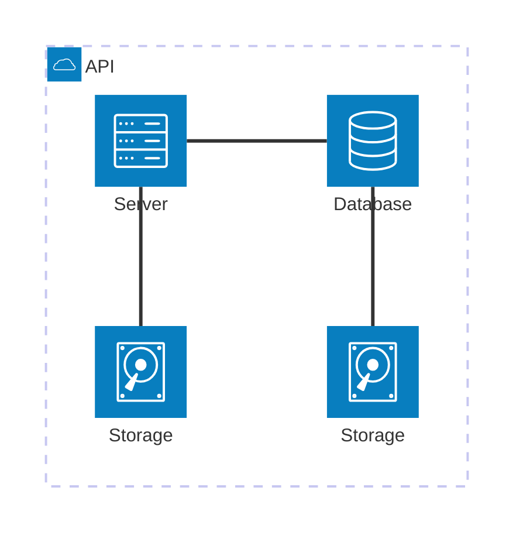

## Introdução e Objetivo

O roteiro 1 contempla a fundação de toda a infraestrutura da Cloud, que foi montada a partir de um KIT que contava com os seguintes componentes:

- 1 NUC (main) com 10Gb e 1 SSD (120 Gb)
- 1 NUC (server1) com 12Gb e 1 SSD (120 Gb)
- 1 NUC (server2) com 16Gb e 2 SSD (120 Gb + 120 Gb)
- 3 NUCs (server3, server4 e server5) com 32 Gb e 2 SSD (120 Gb + 120 Gb)
- 1 Switch DLink DSG-1210-28 de 28 portas
- 1 Roteador TP-Link TL-R470T+

Ao longo deste roteiro, passaremos pelos seguintes passos:

- Configuração do KIT via cabo
    - Instalação do Ubuntu Server
    - Instalação do MAAS
    - Configuração do MAAS
    - Reconfiguração do DHCP
    - Cadastro dos servidores via MAAS
    - Criação das pontes OVS    

- Configuração do KIT via acesso remoto
    - Configuração de um servidor de banco de dados Postgres
    - Deploy de uma aplicação Django
    - Utilização do Ansible
    - ...

<p align="justify">
Ao final deste roteiro, o objetivo principal é termos, portanto, uma Cloud com um primeiro gerenciador de deploy instalado. A partir disso, o cliente já será capaz de realizar requisições ao servidor se estiver conectado à rede Wi-Fi do Insper. 
</p>

## Montagem do Roteiro

Os pontos "tarefas" são os passos seguidos para a realização do roteiro. 

Este modelo de organização orientado por tarefas será utilizado em todos os roteiros.

## Tarefa 1: Instalação do Ubuntu Server

<p align="justify">
Antes de iniciar a instalação, foi essencial capturar <b>imagens de todos os endereços MAC dos servidores (1 a 5)</b>, pois a configuração do MAAS na etapa seguinte necessitará dessas informações. 
</p>

<p align="justify">
Essa ação ocorreu simultaneamente à instalação do Ubuntu Server na NUC principal, pois, a partir da Tarefa 2, as fontes de alimentação não poderão mais ser desconectadas e, devido à forma como o kit foi montado, não seria possível remover as NUCs de suas posições para visualizar os endereços sem desligá-las da tomada.
</p>

Simultaneamente, foram seguidos os passos descritos a seguir para configurar a NUC main:

1. **Baixando a imagem do Ubuntu Server**  
    - Download da versão 22.04 LTS do Ubuntu Server a partir [do site oficial do Ubuntu](https://ubuntu.com/download/server).

2. **Criação um pendrive bootável**  
    - Uso do software [Rufus](https://rufus.ie) para gravar a imagem no pendrive.

3. **Acesso à BIOS**   
    - Com o Pendrive conectado, a BIOS foi acessada a partir a tecla `F12` durante a inicialização.  
    - Configuração de ordem de boot para priorizar o pendrive.  

4. **Configurações de instalação do Ubuntu Server**  
    - Reinicialização da NUC.  
    - Seleção da opção "Install Ubuntu Server" no menu inicial.  
    - Seleção de idioma e layout do teclado.

5. **Criação de usuário e configurações finais**  
    - hostname: main
    - login: cloud
    - senha: clouda
    - IP fixo: 172.16.0.3
    - Name Servers (DNS): DNS do Insper  
</p>

--- 

## Tarefa 2: Instalação do MAAS

Instalando o MAAS:

<!-- termynal -->

``` bash
sudo snap install maas --channel=3.5/Stable
```


/// caption
Dashboard do MAAS
///

Conforme ilustrado acima, a tela inicial do MAAS apresenta um dashboard com informações sobre o estado atual dos servidores gerenciados. O dashboard é composto por diversos painéis, cada um exibindo informações sobre um aspecto específico do ambiente gerenciado. Os painéis podem ser configurados e personalizados de acordo com as necessidades do usuário.

## App


### Tarefa 1

### Tarefa 2

Exemplo de diagrama



[Mermaid](https://mermaid.js.org/syntax/architecture.html){:target="_blank"}

## Questionário, Projeto ou Plano

Esse seção deve ser preenchida apenas se houver demanda do roteiro.

## Discussões

Quais as dificuldades encontradas? O que foi mais fácil? O que foi mais difícil?

## Conclusão

O que foi possível concluir com a realização do roteiro?
