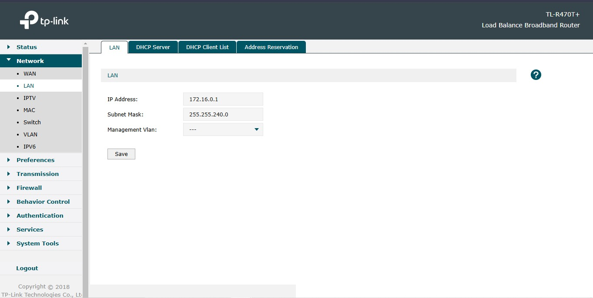
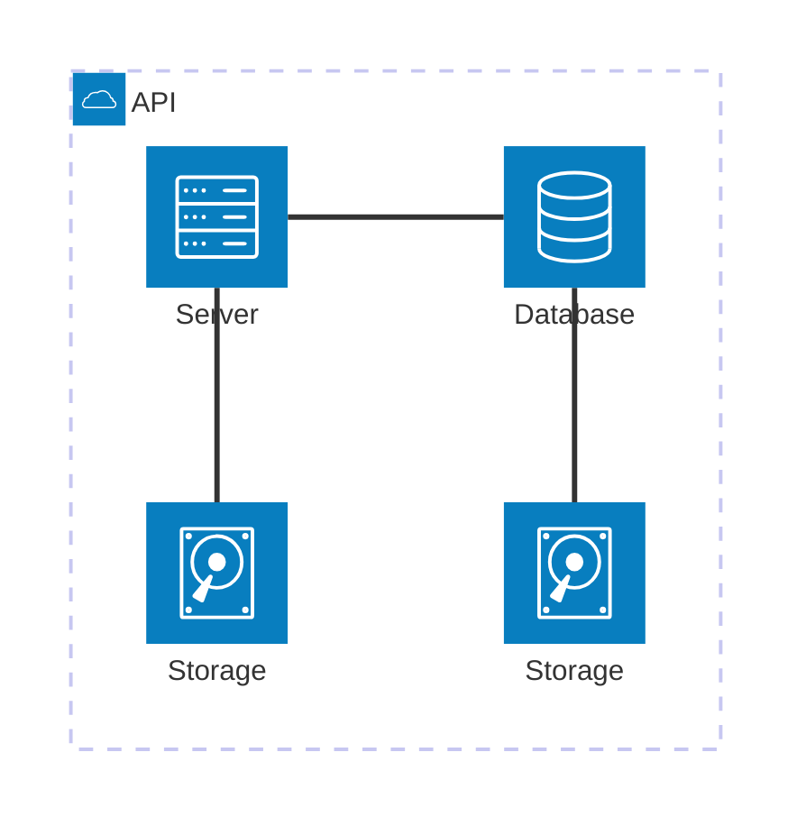

## Introdução e Objetivo

O roteiro 1 contempla a fundação de toda a infraestrutura da Cloud que foi montada a partir de um KIT que contava com os seguintes componentes:

- 1 NUC (main) com 10Gb e 1 SSD (120 Gb)
- 1 NUC (server1) com 12Gb e 1 SSD (120 Gb)
- 1 NUC (server2) com 16Gb e 2 SSD (120 Gb + 120 Gb)
- 3 NUCs (server3, server4 e server5) com 32 Gb e 2 SSD (120 Gb + 120 Gb)
- 1 Switch DLink DSG-1210-28 de 28 portas
- 1 Roteador TP-Link TL-R470T+

Ao longo deste roteiro, passaremos pelos seguintes passos:

- Configuração do KIT via cabo
    - Instalação do Ubuntu Server
    - Instalação do MAAS
    - Configuração do MAAS
    - Reconfiguração do DHCP
    - Cadastro dos servidores via MAAS
    - Criação das pontes OVS    

- Configuração do KIT via acesso remoto
    - Configuração de um servidor de banco de dados Postgres
    - Deploy de uma aplicação Django
    - Utilização do Ansible
    - ...

<p align="justify">
Ao final deste roteiro, o objetivo principal é termos, portanto, uma Cloud com um primeiro gerenciador de deploy instalado. A partir disso, o cliente já será capaz de realizar requisições ao servidor se estiver conectado à rede Wi-Fi do Insper. 
</p>

## Montagem do Roteiro

Os pontos "tarefas" são os passos seguidos para a realização do roteiro. 

Este modelo de organização orientado por tarefas será utilizado em todos os roteiros.

## Tarefa 0: Endereços MAC das NUCs e IP do roteador

<p align="justify">
Antes de iniciar qualquer instalação, foi essencial capturar <b>imagens de todos os endereços MAC dos servidores (1 a 5)</b>. 
</p>

<p align="justify">
Essa ação ocorreu simultaneamente à Tarefa 1, pois, a partir da Tarefa 2, as fontes de alimentação não podem mais ser desconectadas e, devido à forma como o kit foi montado, não seria possível remover as NUCs de suas posições para visualizar os endereços sem desligá-las da tomada.
</p>

<p align="justify">
Além disso, foi realizado um pré-roteiro relativo à montagem de um cabo de rede. Com a conexão ethernet, foi acessada a interface do roteador do KIT e alterou-se o seu endereço de IP para 172.16.0.1. Mais detalhes sobre a escolha deste IP serão fornecidos na Tarefa 1. 
</p>


/// caption
Tela de configuração de IP do roteador e de máscara de subrede
///

## Tarefa 1: Instalação do Ubuntu Server

Para a realização desta primeira tarefa, foram seguidos os passos descritos a seguir para configurar a NUC main:

1. **Download da imagem do Ubuntu Server**  
    - Download da versão 22.04 LTS do Ubuntu Server a partir [do site oficial do Ubuntu](https://ubuntu.com/download/server).

2. **Criação um pendrive bootável**  
    - Uso do software [Rufus](https://rufus.ie) para gravar a imagem no pendrive.

3. **Acesso à BIOS**   
    - Com o Pendrive conectado, a BIOS foi acessada a partir a tecla `F12` durante a inicialização.  
    - Configuração de ordem de boot para priorizar o pendrive.  

4. **Configurações iniciais de instalação do Ubuntu Server**  
    - Reinicialização da NUC.  
    - Seleção da opção "Install Ubuntu Server" no menu inicial.  
    - Seleção de idioma e layout do teclado.

5. **Configurações de subrede, IP, Gateway e DNS**  
    - Máscara de Rede: 172.16.0.0/20
    - Endereço IP da NUC main
    - Gateway: IP do roteador
    - Name servers: DNS do Insper


/// caption
Tela de configuração de Máscara de Rede, IP, Gateway (roteador) e DNS do Insper  
///

*Explicação teórica das configurações feitas:*

<p align="justify">
Para que dispositivos possam estabelecer uma comunicação entre si, é primordial que eles se encontrem na mesma rede. A configuração da subrede, IP, gateway e servidores DNS permite a correta comunicação entre os dispositivos e o acesso à internet ou a outros serviços de rede.
</p>

<p align="justify">
A <b>máscara de rede</b> define o intervalo de endereços IP disponíveis dentro da subrede. No caso da configuração com a máscara `/20`, a rede pode conter até 4.096 endereços IP, garantindo escalabilidade para futuras expansões.
</p>

<p align="justify">
O <b>endereço IP da NUC main</b> é um IP estático atribuído manualmente ao servidor principal (nesse caso, 172.16.0.3, pois o switch assumiu o IP 172.16.0.2), garantindo que ele tenha sempre o mesmo endereço na rede local, facilitando a administração e a comunicação com outros dispositivos.
</p>

<p align="justify">
O <b>gateway</b> corresponde ao IP do roteador (que foi configurado na Tarefa 0 como 172.16.0.1), que atua como a ponte entre a rede interna e redes externas, como a internet. Sem a configuração correta do gateway, os dispositivos na rede local não conseguiriam acessar serviços externos.
</p>

<p align="justify">
Os <b>name servers (DNS)</b> são responsáveis pela resolução de nomes de domínio, convertendo endereços amigáveis, como `www.google.com`, em endereços IP. Utilizar os servidores DNS do Insper garante uma resolução eficiente e confiável dentro do ambiente da instituição.
</p>

Na tela seguinte, referente ao archive mirror, foram aceitas as configurações que vieram por padrão, conforme a print a seguir:


/// caption
Tela de configuração padrão do Ubuntu archive mirror 
///

**Passo final: Criação de usuário e configurações finais**  
    
    hostname: main

    login: cloud
    
    senha: clouda
    
    Name Servers (DNS): DNS do Insper  


/// caption
Tela de configuração do usuário da NUC main segundo as especificações passadas
///

<p align="justify">
Após a conclusão de todos os passos da instalação, foi realizado um reboot da NUC main e removido o pendrive. 
</p>

--- 

## Tarefa 2: Instalação do MAAS

<p align="justify">
Para a instalação do MAAS, optou-se pela versão 3.5.3. No terminal do Ubuntu Server, foram utilizados os comandos a seguir:
</p>

``` bash
$ sudo apt update && sudo apt upgrade -y

$ sudo snap install maas --channel=3.5/stable

$ sudo snap install maas-test-db
```

Para verificar o devido funcionamento do MAAS instalado, foram realizados dois testes com o comando ping, ilustrados na foto a seguir:


/// caption
Tela de teste de funcionamento por meio de pings
///

Após o teste feito com sucesso, foi realizado um acesso da NUC main via SSH com o comando a seguir (ssh usuario@IP):

``` bash
$ ssh cloud@172.16.0.3
```

Dentro da rede local, o MAAS foi iniciazlido e criou-se o administrador cloud, que será necessário para poteriormente ser possível acessar o dashboard.

``` bash
$ sudo maas init region+rack --maas-url http://172.16.0.3:5240/MAAS --database-uri maas-test-db:///

$ sudo maas createadmin
```

Em seguida, foi gerado um par de chaves para autenticação. Após gerada, a chave pública foi copiada.

``` bash
$ ssh-keygen -t rsa

$ cat ./.ssh/id_rsa.pub
```

Utilizando o IP atribuído à NUC main e a porta padrão do MAAS, foi possível acessar o Dashboard via protocolo HTTP (http://172.16.0.3:5240/MAAS).


/// caption
Dashboard do MAAS
///

Conforme ilustrado acima, a tela inicial do MAAS apresenta um dashboard com informações sobre o estado atual dos servidores gerenciados. O dashboard é composto por diversos painéis, cada um exibindo informações sobre um aspecto específico do ambiente gerenciado. Os painéis podem ser configurados e personalizados de acordo com as necessidades do usuário.

## App


### Tarefa 1

### Tarefa 2

Exemplo de diagrama



[Mermaid](https://mermaid.js.org/syntax/architecture.html){:target="_blank"}

## Questionário, Projeto ou Plano

Esse seção deve ser preenchida apenas se houver demanda do roteiro.

## Discussões

Quais as dificuldades encontradas? O que foi mais fácil? O que foi mais difícil?

## Conclusão

O que foi possível concluir com a realização do roteiro?
