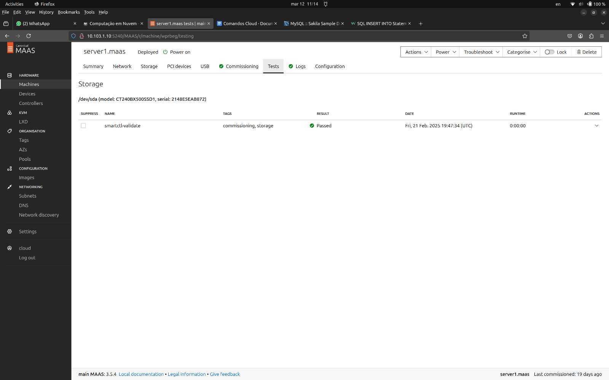

## <b>Introdução e Objetivo</b>

O roteiro 1 contempla a fundação de toda a infraestrutura da Cloud que foi montada a partir de um KIT que contava com os seguintes componentes:

- 1 NUC (main) com 10Gb e 1 SSD (120 Gb)
- 1 NUC (server1) com 12Gb e 1 SSD (120 Gb)
- 1 NUC (server2) com 16Gb e 2 SSD (120 Gb + 120 Gb)
- 3 NUCs (server3, server4 e server5) com 32 Gb e 2 SSD (120 Gb + 120 Gb)
- 1 Switch DLink DSG-1210-28 de 28 portas
- 1 Roteador TP-Link TL-R470T+

Ao longo deste roteiro, passaremos pelos seguintes passos:

- Configuração do KIT via cabo
    - Instalação do Ubuntu Server
    - Instalação do MAAS
    - Configuração do MAAS
    - Reconfiguração do DHCP
    - Cadastro dos servidores via MAAS
    - Criação das pontes OVS    

- Configuração do KIT via acesso remoto
    - Configuração de um servidor de banco de dados Postgres
    - Deploy de uma aplicação Django
    - Utilização do Ansible
    - ...

<p align="justify">
Ao final deste roteiro, o objetivo principal é termos, portanto, uma Cloud com um primeiro gerenciador de deploy instalado. A partir disso, o cliente já será capaz de realizar requisições ao servidor se estiver conectado à rede Wi-Fi do Insper. 
</p>

## <b>Montagem do Roteiro</b>

<p align="justify">
Todo roteiro apresenta uma primeira parte denonimnada <b>Infra</b> e uma segunda chamada de <b>App</b>.
Os pontos <b>tarefas</b> dentro de cada parte são os passos seguidos para a realização do roteiro. 
Este modelo de organização orientado por partes e tarefas será utilizado em <b>todos os roteiros</b>.
</p>

# <b>Infra</b>

## <b>Parte 0: Endereços MAC das NUCs e IP do roteador</b>

<p align="justify">
Antes de iniciar qualquer instalação, foi essencial capturar <b>imagens de todos os endereços MAC dos servidores (1 a 5)</b>. 
</p>

<p align="justify">
Essa ação ocorreu simultaneamente à Tarefa 1, pois, a partir da Tarefa 2, as fontes de alimentação não podem mais ser desconectadas e, devido à forma como o kit foi montado, não seria possível remover as NUCs de suas posições para visualizar os endereços sem desligá-las da tomada.
</p>

<p align="justify">
Além disso, foi realizado um pré-roteiro relativo à montagem de um cabo de rede. Com a conexão ethernet, foi acessada a interface do roteador do KIT e alterou-se o seu endereço de IP para 172.16.0.1. Mais detalhes sobre a escolha deste IP serão fornecidos na Tarefa 1. 
</p>


/// caption
Tela de configuração de IP do roteador e de máscara de subrede
///

## <b>Parte 1: Instalação do Ubuntu Server</b>

Para a realização desta primeira tarefa, foram seguidos os passos descritos a seguir para configurar a NUC main:

1. **Download da imagem do Ubuntu Server**  
    - Download da versão 22.04 LTS do Ubuntu Server a partir [do site oficial do Ubuntu](https://ubuntu.com/download/server).

2. **Criação um pendrive bootável**  
    - Uso do software [Rufus](https://rufus.ie) para gravar a imagem no pendrive.

3. **Acesso à BIOS**   
    - Com o Pendrive conectado, a BIOS foi acessada a partir a tecla `F12` durante a inicialização.  
    - Configuração de ordem de boot para priorizar o pendrive.  

4. **Configurações iniciais de instalação do Ubuntu Server**  
    - Reinicialização da NUC.  
    - Seleção da opção "Install Ubuntu Server" no menu inicial.  
    - Seleção de idioma e layout do teclado.

5. **Configurações de subrede, IP, Gateway e DNS**  
    - Máscara de Rede: 172.16.0.0/20
    - Endereço IP da NUC main
    - Gateway: IP do roteador
    - Name servers: DNS do Insper


/// caption
Tela de configuração de Máscara de Rede, IP, Gateway (roteador) e DNS do Insper  
///

*Explicação teórica das configurações feitas:*

<p align="justify">
Para que dispositivos possam estabelecer uma comunicação entre si, é primordial que eles se encontrem na mesma rede. A configuração da subrede, IP, gateway e servidores DNS permite a correta comunicação entre os dispositivos e o acesso à internet ou a outros serviços de rede.
</p>

<p align="justify">
A <b>máscara de rede</b> define o intervalo de endereços IP disponíveis dentro da subrede. No caso da configuração com a máscara `/20`, a rede pode conter até 4.096 endereços IP, garantindo escalabilidade para futuras expansões.
</p>

<p align="justify">
O <b>endereço IP da NUC main</b> é um IP estático atribuído manualmente ao servidor principal (nesse caso, 172.16.0.3, pois o switch assumiu o IP 172.16.0.2), garantindo que ele tenha sempre o mesmo endereço na rede local, facilitando a administração e a comunicação com outros dispositivos.
</p>

<p align="justify">
O <b>gateway</b> corresponde ao IP do roteador (que foi configurado na Tarefa 0 como 172.16.0.1), que atua como a ponte entre a rede interna e redes externas, como a internet. Sem a configuração correta do gateway, os dispositivos na rede local não conseguiriam acessar serviços externos.
</p>

<p align="justify">
Os <b>name servers (DNS)</b> são responsáveis pela resolução de nomes de domínio, convertendo endereços amigáveis, como `www.google.com`, em endereços IP. Utilizar os servidores DNS do Insper garante uma resolução eficiente e confiável dentro do ambiente da instituição.
</p>

Na tela seguinte, referente ao archive mirror, foram aceitas as configurações que vieram por padrão, conforme a print a seguir:


/// caption
Tela de configuração padrão do Ubuntu archive mirror 
///

**Passo final: Criação de usuário e configurações finais**  
    
    hostname: main

    login: cloud
    
    senha: clouda
    
    Name Servers (DNS): DNS do Insper  


/// caption
Tela de configuração do usuário da NUC main segundo as especificações passadas
///

<p align="justify">
Após a conclusão de todos os passos da instalação, foi realizado um reboot da NUC main e removido o pendrive. 
</p>

--- 

## <b>Parte 2: MAAS - acesso local</b>

### <b>Instalação</b>

<p align="justify">
Para a instalação do MAAS na NUC main (que agora tem um sistema operacional), optou-se pela versão 3.5.3. No terminal do Ubuntu Server, foram utilizados os comandos a seguir:
</p>

``` bash
$ sudo apt update && sudo apt upgrade -y

$ sudo snap install maas --channel=3.5/stable

$ sudo snap install maas-test-db
```

Para verificar o devido funcionamento do MAAS instalado, foram realizados dois testes com o comando ping, ilustrados na foto a seguir:


/// caption
Tela de teste de funcionamento por meio de pings
///

Após o teste feito com sucesso, foi realizado um acesso da NUC main via SSH com o comando a seguir (ssh usuario@IP):

``` bash
$ ssh cloud@172.16.0.3
```

### <b>Configuração</b>

<p align="justify">
Dentro da rede local, o MAAS foi inicializado e criou-se o administrador cloud, que será necessário para poteriormente ser possível acessar o dashboard. Antes da inicialização foi necessário realizar um <b>reboot</b>.
</p>

``` bash
$ sudo maas init region+rack --maas-url http://172.16.0.3:5240/MAAS --database-uri maas-test-db:///

$ sudo maas createadmin
```

Em seguida, foi gerado um par de chaves para autenticação. Após gerada, a chave pública foi copiada.

``` bash
$ ssh-keygen -t rsa

$ cat ./.ssh/id_rsa.pub
```

<p align="justify">
Utilizando o IP atribuído à NUC main e a porta padrão do MAAS, foi possível acessar o Dashboard via protocolo HTTP (http://172.16.0.3:5240/MAAS). O login foi realizado através do admin criado nos passos anteriores.
</p>


/// caption
Dashboard do MAAS
///

<p align="justify">
Conforme ilustrado acima, a tela inicial do MAAS apresenta um dashboard com informações sobre o estado atual dos servidores gerenciados. O dashboard é composto por diversos painéis, cada um exibindo informações sobre um aspecto específico do ambiente gerenciado. 
</p>

<p align="justify">
Utilizando a interface gráfica do Dashboard, primeiramente, foi configurado um <b>DNS</b> forwarder utilizando o DNS do Insper (Networking > DNS).
</p>

<p align="justify">
Em seguida, foram importadas imagens do <b>Ubuntu 22.04 LTS</b> e <b>Ubuntu 20.04 LTS</b> em Configuration > Images > Ubuntu Releases e feito o <b>upload da chave copiada no terminal SSH</b>. 
</p>

<p align="justify">
Por fim, foi passado o parâmetro kernel <b>net.ifnames=0</b> em Settings > Configuration > Kernel Parameters.
</p>

### <b>Chaveando o DHCP</b>

<p align="justify">
O DHCP (Dynamic Host Configuration Protocol) é um protocolo de rede que permite a configuração automática de dispositivos em uma rede IP. Ele é principalmente responsável por atribuir dinamicamente endereços IP, eliminando a necessidade de configuração manual, mas também pode assumir funções como, por exemplo, definir a máscara de sub-rede e fornecer servidores DNS.
</p>

<p align="justify">
Até o momento, o dispositivo da nossa sub-rede contendo este protocolo é o roteador. Porém, nesta etapa isto foi modificado.
</p>

<p align="justify">
Primeiramente, dentro do MAAS Controller, o DHCP foi habilitado na NUC Main e, conforme ilustra a imagem a seguir, o Reserved Range foi alterado para iniciar em 172.16.11.1 e acabar em 172.16.14.255.
</p>


/// caption
Tela de configuração dos Reserved Ranges dentro do MAAS Controller
///

<p align="justify">
Além disso, como mais de um dispositivo não pode conter o protocolo DHCP dentro de uma mesma sub-rede (mais de um dispositivo tentando atribuir um IP a outro dispositivo automaticamente), também foi necessário desativar o DHCP no roteador.
</p>


/// caption
Tela de desabilitação do DHCP no roteador
///

A saúde do sistema também foi verificada a partir da página de Controladores no Dashboard, ilustrada a seguir.


/// caption
Tela de verificação da saúde do sistema
///

### <b>Comissionando servidores</b>

<p align="justify">
Com o DHCP agora devidamente chaveado, os servers 1 a 5 foram cadastrados como machines no Dashboard do MAAS. 
Para tanto, foram resgatados os endereços MAC capturados na Tarefa 0, alterada a opção <b>Power Type</b> para <b>Intel AMT</b>, configurada a senha `CloudComp6s!` para todos os servidores e o <b>IP 172.16.15.X</b> (X sendo o número do servidor configurado).
</p>

<p align="justify">
Após a comissão automática, todos os nós apareceram com o status Ready e as especificações de armazenamento das NUCs foram confirmadas. Além disso, o <b>roteador foi adicionado como device</b>.
</p>


/// caption
Adicionando roteador como device
///

### OVS Bridge

<p align="justify">
Antes de possibilitar o acesso remoto ao KIT, um passo final foi criar, para cada servidor, uma ponte Open vSwitch (OVS). Todas as pontes tiveram o nome "br-ex" atribuído a elas. A seguir, tem-se uma ilustração de como a bridge ficou configurada para o server 1, na interface do dashboard do MAAS.
</p>


/// caption
Interface do Server 1 após a criação da ponte Open vSwitch (OVS)
///

## <b>Parte 3: MAAS - acesso remoto</b>

Para que seja possível acessar o KIT remotamente, e não mais através do cabo na rede local, é necessário realizar a criação de um gateway NAT. 

<p align="justify">
A intenção por trás do acesso remoto é que o computador seja capaz de conversar com o servidor main dentro da subrede configurada até agora apenas por meio de uma conexão com a Rede Wi-Fi do Insper. 
</p>

<p align="justify">
O NAT é justamente o serviço que possibilita que dispositivos dentro de uma rede privada acessem redes externas (como a internet) através de um único endereço IP público. Ele traduz os endereços IP privados da subrede para o endereço IP do roteador ao enviar pacotes para fora da rede e realiza o processo inverso ao receber respostas, garantindo assim a comunicação adequada entre os dispositivos.
</p>


/// caption
Ilustração teórica de funcionamento da subrede
///

Na ilustração acima, a linha tracejada verde representa a conexão entre um computador (que se encontra conectado à LAN do Insper) com a NUC main da subrede privada que foi configurada até o momento. 

<p align="justify">
Para que fosse estabelecida tal conexão, foram seguidas as instruções contidas no manual de uso do roteador do KIT para possibilitar o redirecionamento do dispositivo que tentasse se conectar à portas 22 (padrão SSH) e 5240 (padrão MAAS) a partir do IP público 10.103.1.10, que é o endereço do roteador fora da rede privada.
</p>

Ao final da configuração do NAT, portanto, a interface do roteador ficou da seguinte forma:


/// caption
Interface do roteador após a configuração do NAT
///

A partir deste momento, portanto, passou a ser possível conectar-se ao dashboard do MAAS e aos demais servidores por meio do seguinte comando SSH no terminal do computador:

``` bash
$ ssh cloud@10.103.1.10
```

# <b>App</b>

Na parte da aplicação deste primeiro roteiro, foi realizado um deploy manual de uma aplicação simples em Django nos servidores.

### <b>Parte 1: Criação do banco de dados</b>

Acessando o terminal do server 1 via SSH, foi criado um usuário (senha: cloud) por meio dos comandos:

``` bash
$ sudo apt update

$ sudo apt install postgresql postgresql-contrib -y

$ sudo su - postgres

$ createuser -s cloud -W
```

Em seguida, foi criado o banco de dados e exposto o serviço para acesso:

``` bash
$ createdb -O cloud tasks

$ nano /etc/postgresql/14/main/postgresql.conf
```

Saindo do usuário postgres, liberou-se o firewall e o serviço foi reiniciado:

``` bash
$ sudo ufw allow 5432/tcp

$ sudo systemctl restart postgresql
```

**Tarefa 1.1) Dentro do server1, status do banco de dados se mostra ativo.**

```
$ sudo systemctl status postgresql
```


/// caption
Status do PostgreSQL vendo do server1
///

**Tarefa 1.2) Inicia a sessão e utiliza do computador/serviço remotamente, através da porta 5240, na MAIN. Serviço acessível da MAIN.**

```
$ telnet localhost 5240
```


/// caption
Conexão estabelecida entre a MAIN e o serviço remoto
///

**Tarefa 1.3) Serviço acessível na própria máquina onde o postgresql foi instalado.**

```
$ sudo su - postgres
```


/// caption
PostgreSQL acessível de dentro do server em que está alocado
///

**Tarefa 1.4) Acessando a configuração do postgresql, foi possível verificar a porta na sessão ‘CONNECTIONS AND AUTHENTICATION’**

```
Comando: $ nano /etc/postgresql/14/main/postgresql.conf
```


/// caption
Configurações do PostgreSQL (default)
///

### <b>Parte 2: Aplicação Django</b>

<p align="justify">
Após requisitar acesso a uma máquina em nosso servidor (<b><i>Comando 1</i></b>), e inserir o token da aba ‘API keys’ presente no Dashboard, solicitamos ao MaaS a alocação de uma máquina (<b><i>Comando 2</i></b>) e realizamos o deploy da nossa aplicação (<b><i>Comando 3</i></b>), sendo ‘system_id’ o id do server alocado, visível no link do Dashboard ao clicar na máquina desejada.
</p>

```
$ maas login [login] http://172.16.0.3:5240/MAAS/    # Requisição de máquina
$ maas [login] machines allocate name=[server_name]  # Solicita alocação a MAIN
$ maas [login] machine deploy [system_id]            # Deploy da aplicação
```

<p align="justify">
Acessando o servidor via SSH, clonamos o repositório onde teremos a aplicação Django. Entrando no diretório tasks, fazemos a instalação das dependências do repositório. 
</p>

``` bash
$ git clone https://github.com/raulikeda/tasks.git

$ ./install.sh # Instalação das dependências
```

<p align="justify">
Após um breve reboot da máquina, iremos acessar o arquivo ‘/etc/hosts’ para darmos permissão a nossa MAIN de utilizar a aplicação como administrador. Podemos verificar a conexão com a aplicação com o comando:
</p>

``` bash
$ wget http://[IP server_app]:8080/admin/ # Verificando conexão com a aplicação
```

<p align="justify">
Agora, ao acessar o MaaS podemos criar um túnel do serviço do servidor da aplicação na porta 8080 para nosso localhost na porta 8001 usando a conexão SSH, desde que a porta 8001 não esteja sendo utilizada. Podemos então acessar a página de administrador do Django acessando no navegador o link: http://localhost:8001/admin/.
</p>

``` bash
$ ssh cloud@10.103.0.X -L 8001:[IP server_app]:8080 # conectando via SSH
```

**Tarefa 2.1) Dashboard do MAAS com as máquinas.**


/// caption
Servidores na interface do MAAS
///

**Tarefa 2.2) Aba imagens, com as imagens sincronizadas**


/// caption
Imagens sincronizadas na interface do MAAS
///

**Tarefa 2.3) Da Aba de cada maquina mostrando os testes de hardware e commissioning com Status "OK"**

**Server 1:**


/// caption
Testes de hardware do server 1
///

/// caption
Comissioning do server 1
///

**Server 2:**


/// caption
Testes de hardware do server 2
///

/// caption
Comissioning do server 2
///

**Server 3:**


/// caption
Testes de hardware do server 3
///

/// caption
Comissioning do server 3
///

**Server 4:**


/// caption
Testes de hardware do server 4
///

/// caption
Comissioning do server 4
///

**Server 5:**


/// caption
Testes de hardware do server 5
///

/// caption
Comissioning do server 5
///

### <b>Parte 3: CHECKPOINT - Status dos servidores após a instalação manual do Django</b>

<p align="justify">
Com as mudanças feitas na parte 2, antes de continuarmos precisamos garantir algumas coisas:
</p>

**Tarefa 3.1) As 2 Máquinas se mostram ativas e com seus IPs definidos no Dashboard do MaaS**


/// caption
Servidores na interface do MAAS
///

**Tarefa 3.2) A aplicação Django se encontra no ar, está conectada ao server e acessível a partir do túnel**


/// caption
Aplicação Django conectada ao server e acessível através do tunel
///

### <b>Parte 4: Ansible - deploy automatizado de aplicação</b>

<p align="justify">
Vamos partir para uma abordagem diferente agora. Até o momento, temos apenas uma aplicação Django que foi instalada manualmente apenas no servidor 2. Contudo, é comum que uma mesma aplicação seja alocada em mais de uma máquina, pois podemos dividir a carga de acesso entre os nós e, além disso, se um node cair o outro está no ar, para que nosso cliente acesse.
</p>

<p align="justify">
Dessa forma, nesta parte foi criada uma segunda aplicação Django no servidor 3 que compartilha com o servidor 2 o mesmo banco de dados criado no servidor 1. Porém, em vez de realizar os mesmos passos da instalação manual feita na parte 2, optou-se por utilizar o Ansible, um gerenciador de deploy que traz benefícios que serão detalhados mais adiante.
</p>

<p align="justify">
Após feito o deploy do terceiro servidor, o Ansible foi instalado na MAIN e um playbook foi criado no nó 3 para a instalação do Django. Os comandos utilizados foram:
</p>

``` bash
$ sudo apt install ansible # Instalação do Ansible

$ wget https://raw.githubusercontent.com/raulikeda/tasks/master/tasks-install-playbook.yaml # Playbook do Ansible

$ ansible-playbook tasks-install-playbook.yaml --extra-vars server=[IP server3] # Instalação do playbook na máquina 3
```

**Tarefa 4.1) Print da tela do Dashboard do MAAS com as 3 Máquinas e seus respectivos IPs.**


/// caption
Dashboard do MaaS com os três servidores com deploy feito e seus respectivos IPs
///

**Tarefa 4.2) Print da aplicação Django, provando a conexão com o server2**


/// caption
Aplicação Django funcionando localmente via servidor 2
///

**Tarefa 4.3) Print da aplicação Django, provando a conexão com o server3**


/// caption
Aplicação Django funcionando localmente via servidor 3
///

**Tarefa 4.4) Diferença entre instalar manualmente a aplicação Django e utilizando o Ansible**

<p align="justify">
A diferença principal entre instalar manualmente uma aplicação Django em um host e utilizar o Ansible está na automação, repetibilidade e eficiência da configuração do ambiente.
</p>

<p align="justify">
No lugar de ter que manualmente configurar um ambiente virtual, instalar as dependências necessárias (armazenadas em um requirements.txt) e pacotes como Python, pip e dependências do Django, o Ansible permite automatizar todo esse processo através de playbooks.
</p>

<p align="justify">
Além de automatizar todas as etapas da instalação e configuração, o Ansible segue instruções precisas que proporcionam um gerenciamento de múltiplos servidores ao mesmo tempo, que é útil para escalar a aplicação, e garantem um processo idêntico de configuração na necessidade de mais máquinas que cuidam da aplicação. 
</p>

<p align="justify">
A grande vantagem de utilizar esta ferramenta é, portanto, a sua capacidade de superar uma abordagem manual que é propensa a erros humanos, demorada e difícil de reproduzir no momento de expansão para outros servidores.
</p>

### <b>Parte 5: Balancamento de carga usando Proxy Reverso</b>

<p align="justify">
Agora que fizemos a instalação do Django, tanto manualmente como utilizando o Ansible, podemos criar um servidor para agir como um ponto único de entrada, verificando a disponibilidade de cada server e garantindo uma melhor experiência de uso para o usuário. O nome deste mecanismo é <b>Loadbalancing</b> e ele é especialmente útil para realizar esta distribuição de tráfego de entrada por vários servidores privados, garantindo tolerância a falhas e maior estabilidade.
</p>

<p align="justify">
Para isso, vamos utilizar o <b>NGINX</b>, que usa o algortimo Round Robin para balanceamento de carga para um conjunto IPs disponíveis cadastrados. Ele é relativamente simples de implementar e não considera fatores como tempo de resposta do servidor e a região geográfica de acesso, mas será suficiente para nossa aplicação.
</p>

<p align="justify">
Iniciando, vamos iniciar fazendo deploy de um novo servidor (server4), que irá realizar fazer este trabalho de Loadbalancing para os servidores em que instalamos nossas aplicações Django, em nosso Dashboard do MaaS.
</p>

**Tarefa 5.1) Print da tela do Dashboard do MAAS com as 4 Máquinas e seus respectivos IPs.**


/// caption
Dashboard do MaaS com os quatro servidores com deploy feito e seus respectivos IPs
///

<p align="justify">
Após terminar o deploy, vamos acessar o servidor 4 via SSH e, em seu terminal, vamos realizar a instalação do nginx.
</p>

```
$ ssh ubuntu@{IP Server4}
$ sudo apt-get install nginx
```

<p align="justify">
Para definir quais servidores o Loadbalancer Round Robin utilizará para o balanceamento de cargas, precisamos editar o arquivo de configuração de sites disponíveis do Nginx:
</p>

```
$ sudo nano /etc/nginx/sites-available/default
```

<p align="justify">
Primeiro, vamos adicionar, <b>antes do bloco server</b>, um bloco upstream para que o nginx saiba quais servidores serão aqueles que iremos utilizar como backend para tratar as requisições recebidas. No nosso caso, deixaremos assim:
</p>

```
upstream backend {
    server2 {IP server2}:8080;
    server3 {IP server3}:8080;
}
```

<p align="justify">
Depois, vamos substituir o bloco server presente no arquivo por padrão e vamos configura-lo para ficar escutando a porta 80 e para utilizar um <i>proxy_pass</i> para direcionar as requisições aos server backend.
</p>

```
server {
    listen 80;

    location / {
        proxy_pass http://backend;
    }
}
```

<p align="justify">
Para registrar as alterações, precisamos dar um restart no nginx com o seguinte comando:
</p>

```
$ sudo service nginx restart
```

<p align="justify">
Pronto! O nginx já está configurado e pronto uso.
</p>

<p align="justify"> 
Agora, só nos falta verificar a conexão com os servidores 2 e 3 a partir do servidor 4. Para isso vamos iniciar modificando o <i>views.py</i> de cada servidor onde instalamos o Django. Vamos trocar o print presente, para podermos identificar se estamos conectados no servidor 2 ou no servidor 3. Veja um exemplo para o servidor 2:
</p>

```
$ sudo nano tasks/tasks/views.py
```

``` py
# Exemplo de resolução
from django.shortcuts import render

from django.http import HttpResponse

def index(request):

  return HttpResponse("Hello from server 2!")
```

**Tarefa 5.2) Conteúdo da mensagem contida na função `index` do arquivo `tasks/views.py` de cada server para distinguir ambos os servers.**


/// caption
Conexão com o server2 a partir do túnel
///


/// caption
Conexão com o server3 a partir do túnel
///

<p align="justify"> 
Após fazer a mesma coisa para o servidor 3, vamos sair dos servidores, incluindo a main, usando o comando:
</p>

```
$ exit
```

<p align="justify"> 
Vamos acessar novamente a main, porém utilizando uma pipeline para o server4:
</p>

```
$ ssh cloud@{IP server1} -L 8081:{IP server4}:80
```

<p align="justify"> 
Este comando, basicamente, cria uma conexão SSH com redirecionamento de porta, se conectando com o server1 (<b>ssh cloud@{IP server1}</b>), com redirecionamento de porta local (<b>-L</b>) e fazendo um túnel que:
</p>

<li align="justify"> 
Toda conexão feita na porta <b>8081</b> da máquina local é encaminhada para o <b>server1</b>.
</li>
<li align="justify"> 
A partir de <b>server1</b>, o tráfego é redirecionado para o <b>server4</b> na porta <b>80</b>.
</li>

<p align="justify"> 
<b>OBS:</b> Todas as portas mencionadas aqui, foram setadas e configuradas previamente no roteiro.
</p>

<p align="justify"> 
Com a nginx configurado e o túnel criado, podemos acessar ambos os servidores em nosso navegador com o link:
</p>

<li align="justify"> 
<a href='localhost:8081/tasks/'>localhost:8081/tasks/</a>
</li>

<p align="justify"> 
Pronto! Agora podemos verificar que ao acessar este link, uma hora somos recebidos com a mensagem do server 2, outra hora com a mensagem do server 3.
</p>

**Tarefa 5.3) Prints das respostas de cada request, provando que voce está conectado ao server 4, que é o Proxy Reverso e que ele bate cada vez em um server diferente server2 e server3.**


/// caption
Conexão com o server2 a partir do túnel
///


/// caption
Conexão com o server3 a partir do túnel
///