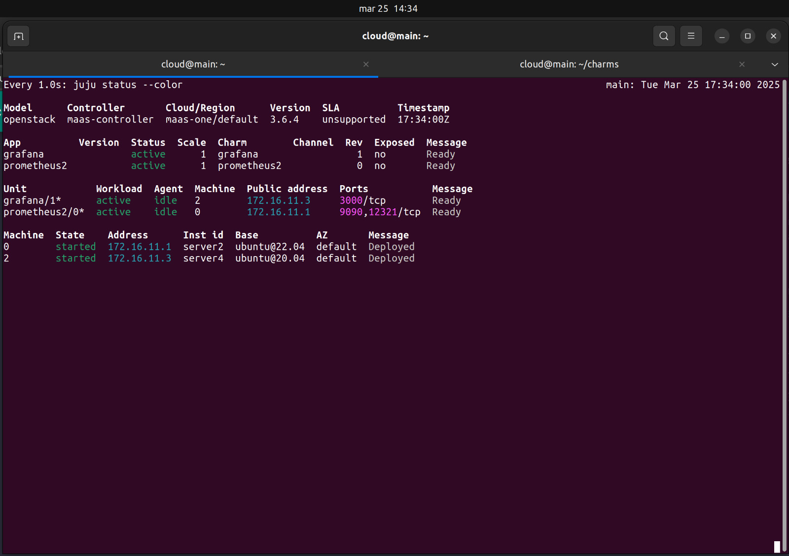
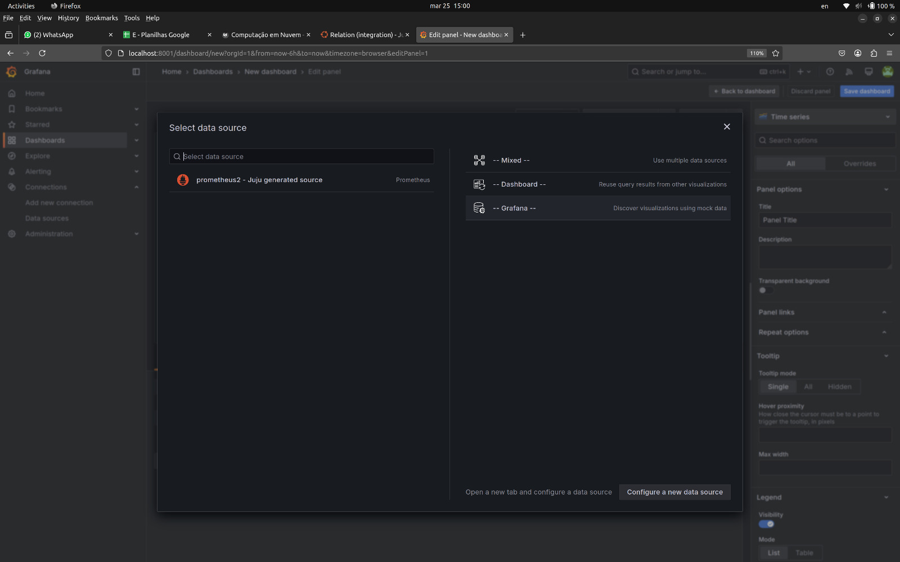
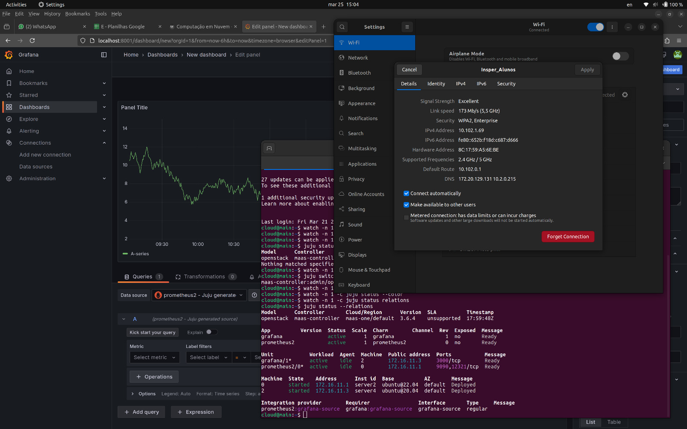
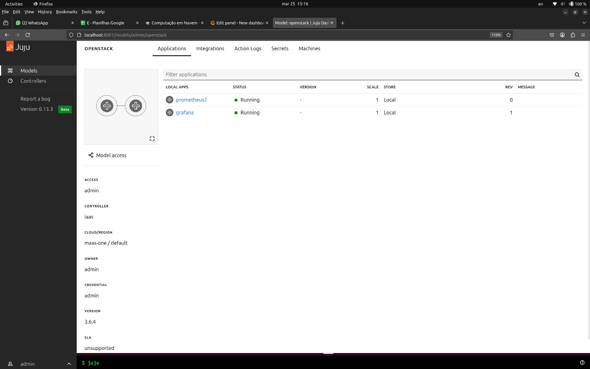

## <b>Introdução e Objetivo</b>

<p align="justify">
O roteiro 2 contempla uma abordagem nova em relação ao roteiro 1: a utilização de uma nova plataforma de gerenciamento de aplicações distribuídas. Assim, em vez de realizar as instalações de toda a infraestrutura manualmente (conforme foi feito no roteiro anterior), será utilizado o Juju, um outro orquestrador de deploy que integra com o MaaS.
</p>

<p align="justify">
Por conta desta nova abordagem, todas as máquinas contendo as modificações do roteiro 1 foram liberadas, retornando para o status "Ready" no dashboard do MaaS.
</p>

<p align="justify">
Ao final deste roteiro, o objetivo principal é termos, portanto, uma Cloud com um novo gerenciador de deploy instalado.
</p>

## <b>Montagem do Roteiro</b>

<p align="justify">
Todo roteiro apresenta uma primeira parte denonimnada <b>Infra</b> e uma segunda chamada de <b>App</b>.
Os pontos <b>tarefas</b> dentro de cada parte são os passos seguidos para a realização do roteiro. 
Este modelo de organização orientado por partes e tarefas será utilizado em <b>todos os roteiros</b>.
</p>

# <b>Infra</b>

## <b>Parte 1: Instalação do Juju</b>

<p align="justify">
A instalação do Juju foi realizada na máquina <b>main</b>, acessada via SSH. O seguinte comando foi utilizado:
</p>

``` bash
$ sudo snap install juju --channel 3.6
```

## <b>Parte 2: Arquivos de definição de cloud</b>

<p align="justify">
Como o Juju utilizará o MaaS como provedor de máquinas e sistema operacional, inicialmente foi necessário garantir que o Juju reconhecesse o MaaS como um provedor de recursos válido.
</p>

Após essa verificação, criou-se um arquivo de configuração chamado *maas-cloud.yaml* com o seguinte conteúdo:

``` bash
  clouds:
    maas-one:
      type: maas
      auth-types: [oauth1]
      endpoint: http://192.168.0.3:5240/MAAS/
```

Em seguida, foi adicionada a cloud, utilizando o seguinte comando:

``` bash
$ juju add-cloud --client -f maas-cloud.yaml maas-one
```

Por fim, foi necessário adicionar as credenciais MaaS para que o Juju pudesse interagir com a nova cloud adicionada. Um novo arquivo, denominado como *maas-creds.yaml*, foi criado com esta finalidade:

``` bash
credentials:
  maas-one:
  anyuser:
    auth-type: oauth1
    maas-oauth: <API KEY gerado no menu do usuário do MaaS>
```

Essas credenciais foram aplicadas com o comando:

``` bash
$ juju add-credential --client -f maas-creds.yaml maas-one
```

## <b>Parte 3: Criação do controlador</b>

Para finalizar a infraestrutura necessária, foi criado um controlador no **server 1** da nossa rede privada.

<p align="justify">
Para que o Juju saiba em qual servidor o controlador irá ficar, criou-se a tag 'juju' no <b>server 1</b> através dashboard do Maas e, em seguida, foi executado o comando a seguir:
</p>

``` bash
$ juju bootstrap --bootstrap-series=jammy --constraints tags=juju maas-one maas-controller
```

<p align="justify">
Esse comando utiliza a série <b>jammy</b> e define o nome do controlador como <b>maas-controller</b>, vinculado à cloud <b>maas-one</b>.
</p>

# <b>App</b>

Para uma melhor visualização do passo a passo feito a seguir, recomendamos manter um terminal aberto ao lado rodando o seguinte comando:

``` bash
$ watch -n 1 -c juju status --color
```

Nele, será possível visualizar cada mudança feita na infraestrutura em tempo real.

## <b>Parte 1: Instalação do Juju dashboard para o controller</b>

<p align="justify">
Para a instalação do juju dashboard, deve-se, primeiro, ter certeza de que estamos no controlador e, sem seguida, executar o comando necessário:
</p>

``` bash 
$ juju switch maas-controller:admin/maas

$ juju deploy juju-dashboard dashboard
```

## <b>Parte 2: Deploy da aplicação Grafana e Prometheus</b>

Com o Juju dashboard instalado, prosseguimos para a aplicação e a configuração do banco de dados.

<p align="justify">
Neste contexto, será utilizado o Prometheus como banco de dados e o Grafana como plataforma de apresentação visual dos números (tipicamente gráficos e painéis).
</p>

<p align="justify">
O primeiro passo tomado foi a criação um novo modelo, que chamaremos de <code>openstack</code>, onde iremos baixar e realizar as configurações das aplicações.
</p>

``` bash 
$ juju add-model --config default-series=jammy openstack

$ juju switch openstack 
```

<p align="justify">
Após isso, foi criado uma pasta chamada charms para baixar o charm do Grafana e do Prometheus do repositório charm-hub:
</p>

``` bash 
$ mkdir -p /home/cloud/charms

$ cd /home/cloud/charms
```

Em seguida, foi realizado o download das duas ferramentas:

``` bash 
$ juju download grafana

$ juju download prometheus2
```

E, por fim, o deploy dos charms de cada uma:

``` bash 
$ juju deploy ./grafana_r69.charm --base=ubuntu@20.04

$ juju deploy ./prometheus2_XXX.charm
```

<b>Nota: </b> Nos últimos comandos, utilizamos o deploy do grafana em uma versão específica, para `ubuntu@20.04`, por conta de problemas de compatibilidade com versões mais novas.

## <b>Parte 3: Integração do Grafana com o Prometheus</b>

Para que o Grafana mostre os dados contidos no Prometheus, foi utilizado o seguinte comando de integração:

``` bash 
$ juju integrate grafana:grafana-source prometheus2:grafana-source
```


/// caption
Dashboard do MAAS com as máquinas e seus respectivos IPs
///


/// caption
Tela do comando "juju status" com o Grafana ativo
///

Se desconectando da máquina MAIN, demos um `ssh` para entrar na MAIN novamente, porém fazendo um túnel da porta do Grafana (`3000` por padrão) para uma porta da nossa localhost (`8001`):

``` bash
$ ssh cloud@10.103.1.X -L 8001:{IP Server Grafana}:3000
```

Acessando o Dashboard em nosso navegador (<a href="localhost:8001/login">localhost:8001/login</a>), foi utilizado o seguinte procedimento para fazer o login:

<ul>
  <li><b>Login</b>: 
      <ul>
          <li>
            Por padrão: <code>admin</code>
          </li>
      </ul>
  </li>

  <li><b>Senha</b>: 
      <ul>
          <li>
            Para obter a senha do Grafana, temos que pedir ao juju para rodar o comando <code>get-admin-password</code> na unidade onde está o serviço:
          </li>
      </ul>
  </li>
</ul>

``` bash
$ juju run grafana/1 get-admin-password
```

Agora, dentro do Dashboard do `Grafana`, o último passo foi conferir se a integração foi feita corretamente. Para isso, foi criado um dashboard dentro do Grafana e foi selecionado o `Prometheus` como source.


/// caption
Tela do Dashboard do Grafana com o Prometheus aparecendo como source
///


/// caption
Acesso ao Dashboard do Grafana a partir da rede do Insper
///


/// caption
Aplicações sendo gerenciadas pelo Juju 
///

<p align="justify">
Para seguir adiante para o próximo roteiro, o controlador foi deletado usando o comando <i>juju destroy-controller main</i> e o ambiente foi, novamente, reconfigurado para a estaca zero.
</p>
