## <b>Introdução e Objetivo</b>

<p align="justify">
O roteiro 3 contempla uma abordagem nova, mantendo a utlização do Juju para gerenciamento de aplicações distribuídas mas introduzindo agora o openstack.
</p>

<p align="justify">
Ao final deste roteiro, o objetivo principal é termos, portanto, uma Cloud com um novo gerenciador de deploy instalado, utilizando o OpenStack como plataforma de nuvem privada. 
</p> 

<p align="justify"> 
O roteiro é dividido em três etapas: criação da infraestrutura (deploy do OpenStack), configuração dos serviços e redes da nuvem, e, por fim, a utilização da infraestrutura com o deployment de aplicações dentro de máquinas virtuais gerenciadas pela nuvem OpenStack.
</p>

## <b>Montagem do Roteiro</b>

<p align="justify">
Todo roteiro apresenta uma primeira parte denominada <b>Infra</b> e uma segunda chamada de <b>App</b>.
No caso deste roteiro especificamente, também há uma seção intermediária de configuração prévia para o App, denominada de <b>Setup</b>.
Os pontos <b>tarefas</b> dentro de cada parte são os passos seguidos para a realização do roteiro. 
Este modelo de organização orientado por partes e tarefas será utilizado em <b>todos os roteiros</b>.
</p>

# <b>Infra</b>

## <b>Parte 0: Detalhamento dos serviços implantados na cloud</b>

<p align="justify">
Foi implantada uma infraestrutura de nuvem privada utilizando OpenStack, orquestrada com MAAS e Juju, e com armazenamento distribuído via Ceph. Antes de tudo, foi necessário garantir que todas as bridges da nossa nuvem estavam corretamente configuradas com a denominação "br-ex", já que esta é a interface de rede que conectará o OpenStack à rede externa.
</p>

<p align="justify"> 
Também, foi utilizada a interface do MaaS para garantir as especificações necessárias para as nossas máquinas físicas que estão listadas a seguir:
</p>

| Servidor | Tags | CPUs | NICs | RAM | Disks | Storage |
|----------|------|------|------|-----|-------|---------|
| server1  | controller, juju | 2 | 1 | 12 | 1 | 80
| server2  | reserva | 2 | 1 | 16 | 2 | 80
| server3  | compute | 2 | 1 | 32 | 2 | 80
| server4  | compute | 2 | 1 | 32 | 2 | 80
| server5  | compute | 2 | 1 | 32 | 2 | 80

<p align="justify"> 
Por fim, foi definido o modelo do deploy e seguido <a href="https://docs.openstack.org/project-deploy-guide/charm-deployment-guide/latest/install-openstack.html" target="_blank">o tutorial oficial do OpenStack</a> para instalar as seguintes dependências: 
</p>

``` bash
juju add-model --config default-series=jammy openstack

juju switch maas-controller:openstack
```

- Ceph OSD
- Nova Compute
- MySQL InnoDB Cluster
- Vault
- Neutron Networking
- Keystone 
- RabbitMQ
- Nova Cloud Controller
- Placement
- Horizon - OpenStack Dashboard
- Glance 
- Ceph Monitor
- Cinder
- Ceph RADOS Gateway

<p>Com as devidas integrações realizadas, foi executado um último comando de finalização da Infra:</p>

``` bash
juju config ceph-osd osd-devices='/dev/sdb'
``` 

# <b>Setup</b>

!!! note

    Setup baseado na documentação oficial do openstack: <a href="https://docs.openstack.org/project-deploy-guide/charm-deployment-guide/latest/configure-openstack.html">https://docs.openstack.org/project-deploy-guide/charm-deployment-guide/latest/configure-openstack.html</a>


No setup, foi feita a configuração dos serviços que controlam:

- as VMs (Nova);
- os volumes de disco (Cinder);
- a estrutura de rede virtual (Neutron).

## <b>Parte 1: Autenticação</b>

<p align="justify">
Antes de configurar Nova, Cinder e Neutron, é preciso realizar a autenticação no <i>Keystone</i>.
</p>

<p align="justify">
Para isso, foi criado um arquivo <code>openrc.sh</code> contendo as variáveis de ambiente necessárias para que a CLI do OpenStack possa se autenticar automaticamente.
</p>

<p align="justify">
Sempre que for necessário fazer alguma modificação no OpenStack via terminal, é preciso carregar nossas credenciais, presentes no arquivo criado, e obter as permissões necessárias. Para isso, foi utilizado o comando:
</p>

``` bash
source ~/openrc
``` 

<p align="justify">
Para confirmar que as variáveis de ambiente foram carregadas, rodamos o seguinte comando:
</p>

``` bash
env | grep OS_
``` 

<p align="justify">
Isso deve retornar todas as variáveis <code>OS_</code>, como no exemplo a seguir: 
</p>

``` bash
OS_AUTH_URL=https://{KEYSTONE_IP}:5000/v3
OS_USERNAME=admin
OS_PASSWORD=MY_PASSWORD
OS_USER_DOMAIN_NAME=admin_domain
OS_PROJECT_NAME=admin
OS_PROJECT_DOMAIN_NAME=admin_domain
OS_AUTH_VERSION=3
OS_IDENTITY_API_VERSION=3
OS_REGION_NAME=RegionOne
OS_AUTH_PROTOCOL=https
OS_CACERT=/home/ubuntu/.../root-ca.crt
OS_AUTH_TYPE=password
```

## <b>Parte 2: Horizon</b>

<p align="justify">
Para acessar o Horizon (<i>Dashboard</i>), foi criado um túnel via <code>ssh</code> até onde o serviço se encontrava:
</p>

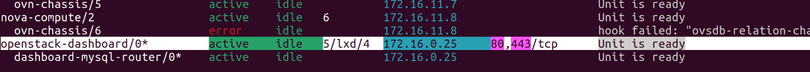
/// caption
Endereço IP e porta do Horizon, no Juju Status
///

``` bash
ssh cloud@{IP_MAIN} -L 8001:{IP_DASHBOARD}:{PORTA_DASHBOARD}
``` 

<p align="justify">
Após isso, no navegador (<a href="http://localhost:8001/horizon">http://localhost:8001/horizon</a>), foi possível entrar no Horizon Dashboard utilizando as credenciais:
</p>

- **Login**: `admin`
- **Senha**: `OS_PASSWORD` visível no `openrc.sh`
- **Domain**: `admin_domain`

<p align="justify">
Acessando o Horizon, é possível encontrar algo parecido com isso: 
</p>

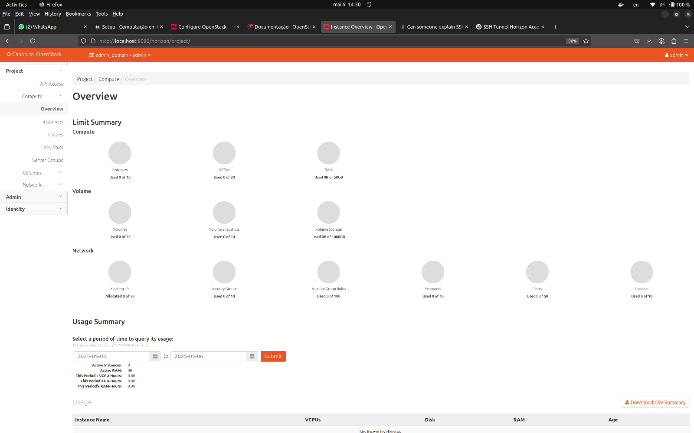
/// caption
Aba compute **overview** no **OpenStack** Dashboard.
///

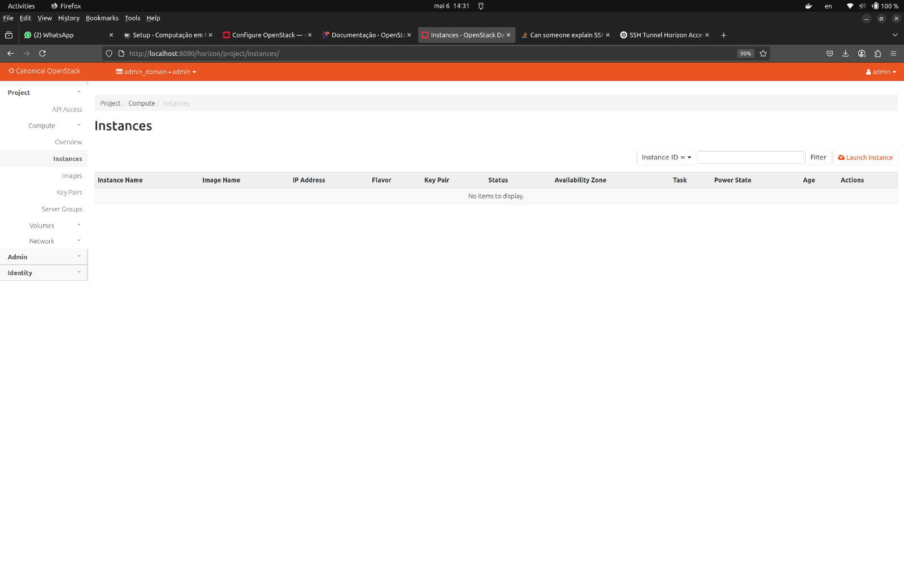
/// caption
Aba compute **instances** no **OpenStack** Dashboard.
///

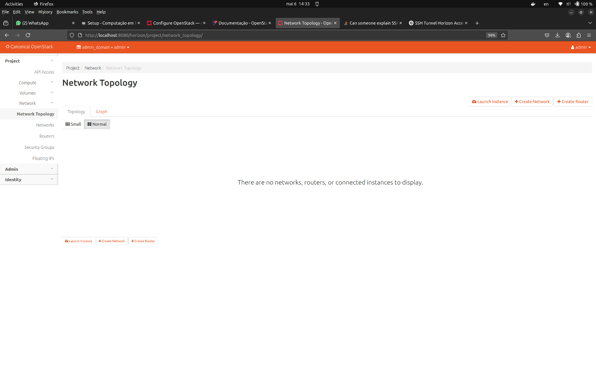
/// caption
Aba network **topology** no **OpenStack** Dashboard.
///

<p align="justify">
Além disso, no Juju status e no Dashboard do <b>MAAS</b> as alocações das máquinas se encontravam da seguinte forma:
</p>

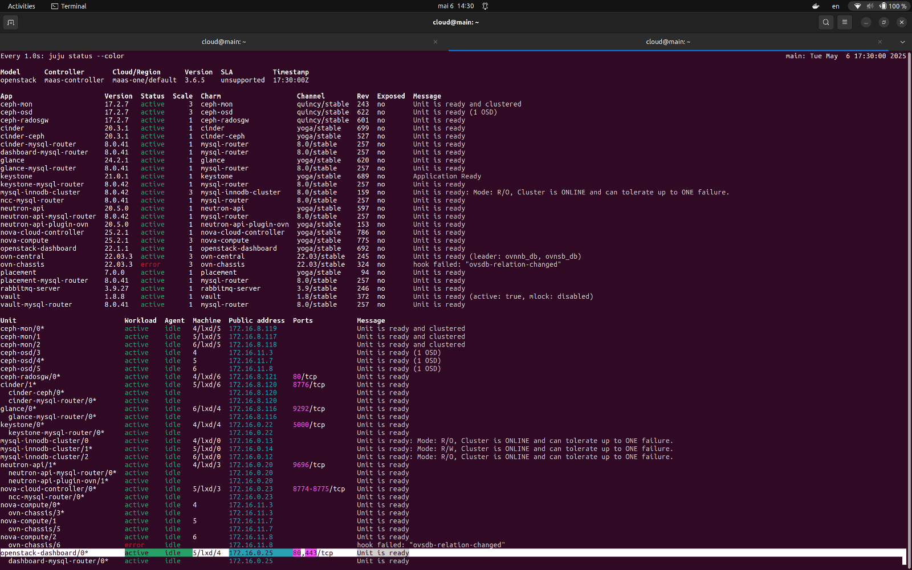
/// caption
Juju Status
///

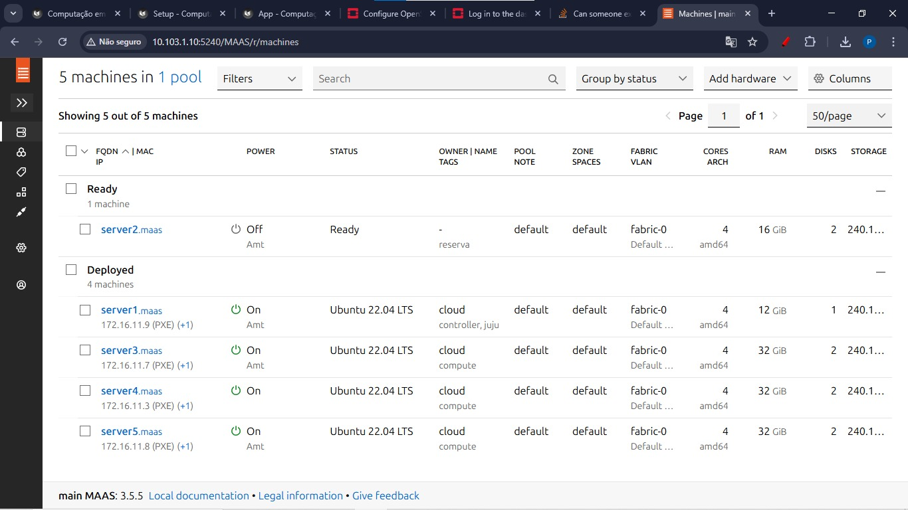
/// caption
Dashboard do **MAAS** com as máquinas alocadas.
///

## <b>Parte 3: Imagens e Flavors</b>

<p align="justify">
A partir desse ponto, foi necessário instalar o <b>client</b> do <i>Openstack</i> no main via snap.
</p>

<p align="justify">
O comando utilizado foi o seguinte:
</p>

```bash
sudo snap install openstackclients
```

<p align="justify">
Carregamos as credenciais, como feito anteriormente via <code>source</code>, e verificamos os serviços disponíveis no Openstack, para garantir que o ambiente estava setado corretamente.
</p>

```bash
openstack service list
```

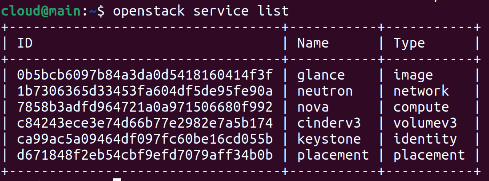
/// caption
Serviços disponíveis no **Openstack**
///

<p align="justify">
Além disso, foi necessário realizar alguns pequenos ajustes na rede antes de prosseguir:
</p>

```bash
juju config neutron-api enable-ml2-dns="true"
juju config neutron-api-plugin-ovn dns-servers="172.16.0.1"
```

<p align="justify">
Baixamos a imagem de boot do Ubuntu Jammy amd64 com o comando:
</p>

```bash
# Cria diretorio para salvar a imagem
mkdir ~/cloud-images

# Baixa imagem do Jammy 
wget http://cloud-images.ubuntu.com/jammy/current/jammy-server-cloudimg-amd64.img \
   -O ~/cloud-images/jammy-amd64.img
```

<p align="justify">
Então importamos a imagem para o serviço <b>Glance</b> do Openstack e o chamamos de <code>jammy-amd64</code>, via:
</p>

```bash
openstack image create --public --container-format bare \
   --disk-format qcow2 --file ~/cloud-images/jammy-amd64.img \
   jammy-amd64
```

<p align="justify">
Para finalizar, criamos os <b>flavors</b>:
</p>

```bash
openstack flavor create --vcpus 1 --ram 1024 --disk 20  m1.tiny    # 1 GB
openstack flavor create --vcpus 1 --ram 2048 --disk 20  m1.small   # 2 GB
openstack flavor create --vcpus 2 --ram 4096 --disk 20  m1.medium  # 4 GB
openstack flavor create --vcpus 4 --ram 8192 --disk 20  m1.large   # 8 GB
```

## <b>Parte 4: Rede Externa</b>

<p align="justify">
Neste passo, criamos uma <b>Rede externa</b> (<i>pública</i>), <code>ext_net</code>.
</p>

```bash
openstack network create --external --share \
   --provider-network-type flat --provider-physical-network physnet1 \
   ext_net
```

<p align="justify">
Para configurar a rede externa, estabelecemos uma faixa de alocação entre <code>172.16.7.0</code> e <code>172.16.8.255</code>.
</p>

<p align="justify">
Isso foi feito a partir da criação de uma <b>Subnet</b>, <code>ext_subnet</code>, utilizando o comando:
</p>

```bash
openstack subnet create --network ext_net --no-dhcp \
   --gateway 172.16.0.1 --subnet-range 172.16.7.0/20 \
   --allocation-pool start=172.16.7.0,end=172.16.8.255 \
   ext_subnet
```

## <b>Parte 5: Rede Interna e Roteador</b>

<p align="justify">
Após criar a Rede externa, criamos a <b>Rede Interna</b> (<i>privada</i>) e <b>Roteador</b>.
</p>

<p align="justify">
Para a <b>Rede Interna</b>, foi criada uma <b>Rede</b>, <code>user1_net</code>, e uma <b>Subnet</b>, <code>user1_subnet</code>, com range <code>192.169.0.0/24</code>.
</p>

```bash
# Rede Interna
openstack network create --internal user1_net
```

```bash
# Subnet
openstack subnet create --network user1_net \
   --subnet-range 192.169.0.0/24 \
   --allocation-pool start=192.169.0.2,end=192.169.0.254 \
   user1_subnet
```

<p align="justify">
Agora, para criar o <b>Roteador</b>, foi utilizado o comando:
</p>

```bash
openstack router create user1_router
```

<p align="justify">
Para finalizar, foi adicionado a <b>subnet privada</b> e configurado para que use a <b>Rede Externa</b> como gateway:
</p>

```bash
openstack router add subnet user1_router user1_subnet
openstack router set user1_router --external-gateway ext_net
```

## <b>Parte 6: Conexão</b>

<p align="justify">
Antes de criar as instâncias, é necessário ter uma forma de acessá-las.
</p>

<p align="justify">
O <i>key-pair</i> é uma chave pública que permite o acesso SSH seguro às instâncias criadas no OpenStack. Ao importar a chave pública, você pode se conectar às instâncias sem precisar usar senhas, aumentando a segurança e facilitando o gerenciamento de acesso.
</p>

<p align="justify">
Por conta disso, foi criado um diretório onde seriam armazenadas essas chaves e, depois disso, importamos um <b>Keypair</b> usando <i>public key</i> (<code>id_rsa.pub</code>) da máquina onde está o <b>MaaS</b>.
</p>

!!! note

     A criação dessa *public key* foi realizada no **Roteiro 1**.

```bash
# Cria o diretório
mkdir ~/cloud-keys

# Pega a chave na main e cria o Keypair
openstack keypair create --public-key ~/.ssh/id_rsa.pub user1
```

<p align="justify">
Para realizar a liberação do <code>SSH</code> e <code>ALL ICMP</code>, entramos no Horizon (<i>dashboard</i>) e modificamos o <i>security group <b>default</b></i>.
</p>

## <b>Parte 7: Instância</b>

<p align="justify">
Para finalizar o setup, foi disparado uma instância <code>m1.tiny</code> (<i>flavor</i>), utilizando o nome <i>client</i> e <b>sem</b> Novo Volume.
</p>

```bash
openstack server create --image jammy-amd64 --flavor m1.tiny \
   --key-name user1 --network user1_net --security-group default \
   client
```

<p align="justify">
Após isso, foi <b>solicitado</b> e <b>alocado</b> um floating IP para a instância.
</p>

```bash
# Solicita um FLOATING_IP
FLOATING_IP=$(openstack floating ip create -f value -c floating_ip_address ext_net)
```

```bash
# Aloca o FLOATING_IP a instância
openstack server add floating ip client $FLOATING_IP
```

<p align="justify">
Para verificar se a instância foi <b>criada</b> e <b>configurada</b> corretamente, a listagem de instâncias dentro do projeto e testamos a conexão via <code>SSH</code>.
</p>

```bash
# Mostra a listagem de todas as instâncias criadas
openstack server list
```

<p align="justify">
O comando anterior deveria devolver algo assim:
</p>

```bash
+--------------------------------------+--------+--------+--------------------------------------+-------------+---------+
| ID                                   | Name   | Status | Networks                             | Image       | Flavor  |
+--------------------------------------+--------+--------+--------------------------------------+-------------+---------+
| a631ff73-b997-4972-9d03-fc376a882120 | client | ACTIVE | user1_net=172.16.8.193, 192.169.0.73 | jammy-amd64 | m1.tiny |
+--------------------------------------+--------+--------+--------------------------------------+-------------+---------+
```

<p align="justify">
Já para o teste de conexão via <code>SSH</code>:
</p>

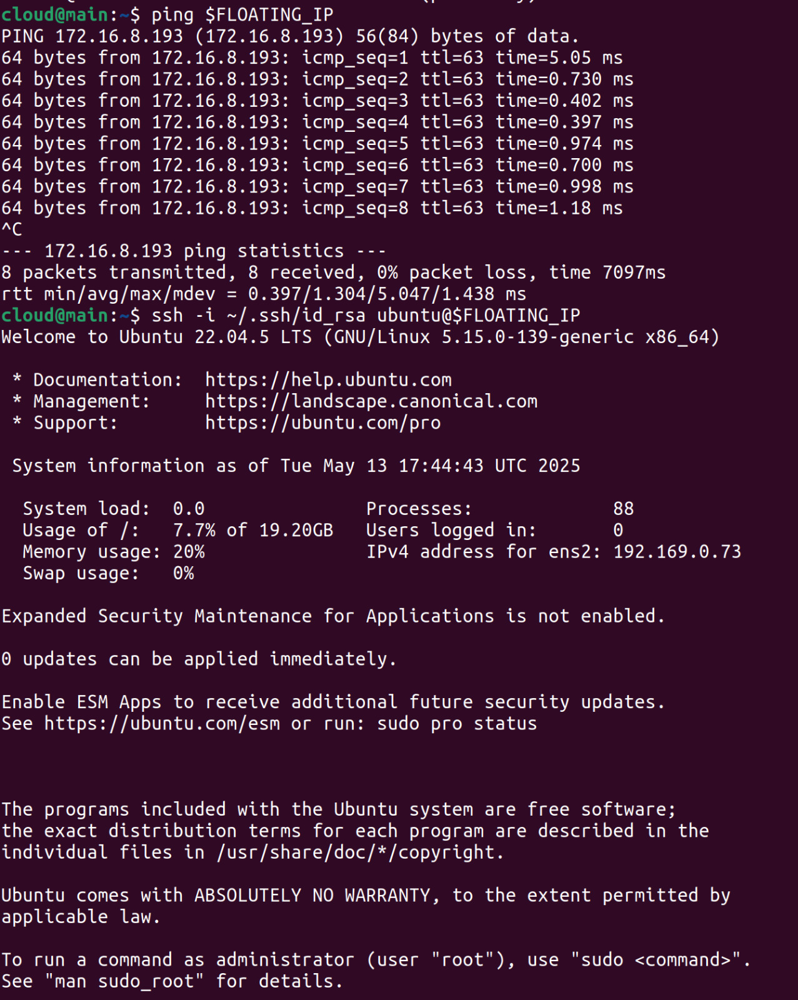
/// caption
Teste de conexão via <b>SSH</b>
///

## Checkpoint

<p align="justify">
Após a criação dos <b>flavors</b>, das <b>Redes</b> (<b>Interna</b> e <b>Externa</b>) e da <b>Instância</b>, além da criação do <b>Keypair</b>, é possível ver uma notável diferença nas abas do Horizon.
</p>

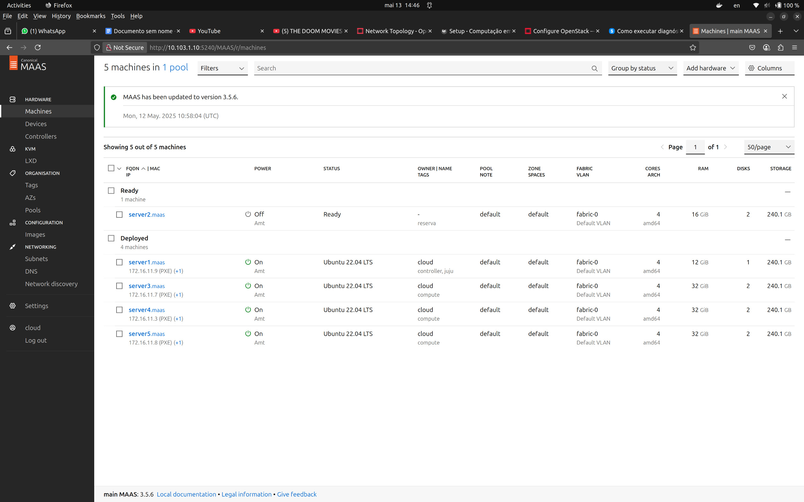
/// caption
Dashboard **MAAS**, após setup
///

<p align="justify">
Na Aba compute <b>overview</b> do <b>Horizon</b>, é possível notar a mudança no gráfico de <b>Instances</b>, <b>VCPUs</b> e <b>RAM</b>, isso se deve a criação da nova instância <code>client</code> que criamos no projeto e, no caso da <b>RAM</b> e <b>VCPUs</b>, as especifícações que demos ao <b>flavor</b> (<code>m1.tiny</code>) utilizado na instância.
</p>

<p align="justify">
Além disso, na parte inferior do <b>Compute > Overview</b>, na seção de <b>Network</b>, agora mostra a existência de um <b>floating IP</b> (referente a <code>Parte 7: Instância</code>), 
de duas novas <b>Networks</b> (<code>Parte 4: Rede Externa</code> e <code>Parte 5: Rede Interna</code>), um novo <b>Router</b> (<code>Parte 5: Roteador</code>) e também de um <b>Security Group</b>, o grupo <code>default</code> criado por padrão pelo OpenStack, além das regras atreladas a esse grupo, algumas criadas automaticamente e outras configuradas manualmente, <code>SSH</code> e <code>ALL ICMP</code> (<code>Parte 6: Conexão</code>).
</p>

<p align="justify">
Para os 4 novos <b>Ports</b>:
<ul>
    <li>
        <p align="justify">
            Port de <code>client</code> na rede <code>user1_net</code>, ao subir a <b>instância</b>.
        </p>
    </li>
    <li>
        <p align="justify">
            Port do <b>roteador</b> <code>user1_router</code> → <code>user1_subnet</code> (final de <code>Parte 5: Roteador</code>).
        </p>
    </li>
    <li>
        <p align="justify">
            Port do <b>roteador</b> <code>user1_router</code> → <b>Gateway externo</b> (<code>ext_net</code>) (final de <code>Parte 5: Roteador</code>).
        </p>
    </li>
    <li>
        <p align="justify">
            Port do <b>Floating IP</b> (<code>Parte 7: Instância</code>).
        </p>
    </li>
</ul>
</p>

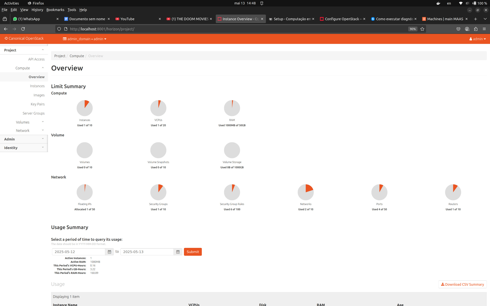
/// caption
Aba compute **overview** do **OpenStack**, após setup
///

<p align="justify">
Na aba <b>Compute > Instances</b>, assim como na <b>Overview</b>, podemos perceber que agora foi registrado a criação da instância <code>client</code>.
</p>

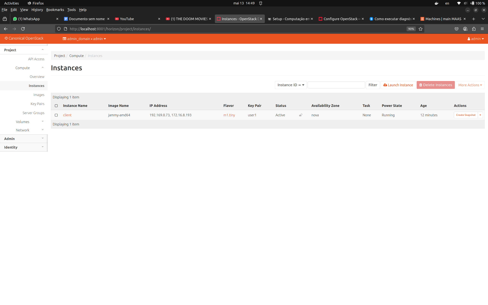
/// caption
Aba compute **instances** do **OpenStack**, após setup
///

<p align="justify">
Na aba <b>Network Topology</b>, é possível verificar de forma visual todas as ligações feitas entre os objetos em cada passo.
</p>

<p align="justify">
As colunas coloridas são referentes as <b>Redes</b>: <code>user1_net</code> (laranja, <b>Rede Interna</b>) e <code>ext_net</code> (azul, <b>Rede Externa</b>).
</p>

<p align="justify">
O <code>user1_router</code>, seria o roteador (<code>Parte 5: Roteador</code>). O IP a sua direita, conectando o roteador a Rede Interna, seria seu <b>IP Interno</b> <code>192.169.0.1</code>, já o IP a sua esquerda, conectando o roteador a Rede Externa, seria seu <b>IP Externo</b> <code>172.16.7.118</code>.
</p>

<p align="justify">
A direita do diagrama, é possível ver a <b>instância</b> <code>client</code>, criada na <code>Parte 7: Instância</code>, juntamente a seu IP atribuido na subnet de <code>user1_net</code>, com valor <code>192.169.0.73</code>.
</p>

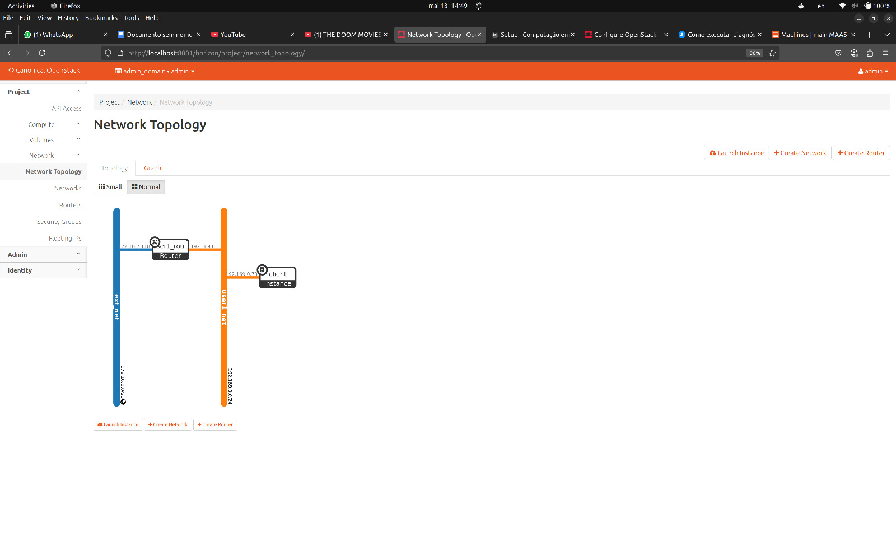
/// caption
Aba network **topology** do **OpenStack**, após setup
///

## Escalando os nós

<p align="justify">
Após verificar se ainda há disponibilidade de alguma máquina no <i>Dashboard</i> do <b>MaaS</b>, alguma máquina que ainda esteja somente <i>allocated</i>, fizemos release desta máquina para poder seguir ao passo final: instalar o <b>Hipervisor</b>.
</p>

<p align="justify">
Após finalizar o realease da máquina, utilizamos o comando a seguir para instalar o <code>hypervisor</code> e realizar o deploy na máquina.
</p>

```bash
juju add-unit nova-compute
```

<p align="justify">
Verificando o <i>juju status</i>, anotamos o número da máquina adicionada e fizemos a instalação do <code>block storage</code>.
</p>

```bash
juju add-unit --to <ID_MAQUINA> ceph-osd
```

## Desenho da arquitetura de rede
**Tarefa 3) Desenho da arquitetura de rede, desde a sua conexão com o Insper até a instância alocada.**

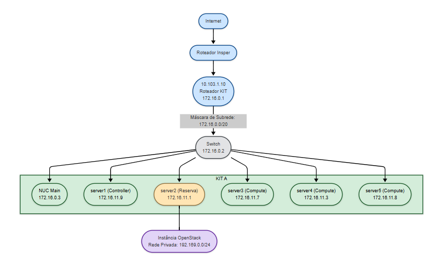
/// caption
Arquitetura de rede
///

# <b>App</b>

## <b>Preparação da arquitetura</b>

<p align="justify">
A principal tarefa a ser completada no App foi a utilização da infraestrutura configurada até o momento para colocar o projeto da disciplina na cloud criada. 
</p>

<p align="justify"> 
Desenvolvido em paralelo, o projeto da disciplina — disponível <a href="https://github.com/antoniolma/insper.cloud-projeto" target="_blank">neste repositório</a> — consistiu em uma aplicação FastAPI composta por três endpoints simples. Para simular uma nuvem mais próxima da realidade, foi adotada a seguinte topologia: 
</p>

- 2 instâncias com a API desenvolvida;
- 1 instância com banco de dados Postgres;
- 1 instância com LoadBalancer, Nginx.

<p align="justify"> 
Em ambientes de produção, utilizar duas instâncias da API é considerado uma boa prática, pois permite garantir balanceamento de carga, tolerância a falhas e alta disponibilidade. Dessa forma, em vez de a requisição do cliente chegar diretamente a uma instância da API, ela é encaminhada primeiro ao Load Balancer, que distribui as requisições entre as instâncias disponíveis, as quais estão conectadas ao banco de dados da aplicação. A seguir, apresenta-se um diagrama que ilustra essa arquitetura: 
</p>

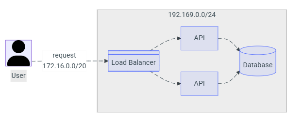
/// caption
Topologia de uso da infraestrutura
///

<p align="justify"> 
Para iniciar a implementação, o dashboard do Horizon foi acessado (via NAT) e, nele, foram criadas as quatro instâncias com os seguintes nomes: load-balancer, api-1, api-2 e database.
</p>


/// caption
Local de visualização e criação de instâncias no dashboard do Horizon
///

<p align="justify"> 
Após criadas as instâncias, foi necessário atribuir a cada uma um IP Flutuante para que fosse possível atingir todas por meio da NUC Main. Afinal, conforme mostrado no diagrama de topologia da rede anteriormente, as instâncias se encontram em uma subrede e possuem IPs que não são úteis para conversar com máquinas que se encontram na rede externa.
</p>

<p align="justify">
Para isso, foram atribuídos IPs flutuantes para cada instância (uma por vez), reutilizando os comandos vistos no Setup: 
</p>

``` bash
FLOATING_IP=$(openstack floating ip create -f value -c floating_ip_address ext_net)

openstack server add floating ip nome-da-instancia $FLOATING_IP
```

<p align="justify">
Além disso, vale ressaltar que, a fim de baratear o custo de manutenção da arquitetura ao máximo sem prejudicar o desempenho do cliente, optou-se pelo flavor m1.tiny para todas as instâncias. 
</p>

<p align="justify">
Contudo, para aplicações com maior demanda e um volume de dados maior para armazenamento, seria provável a necessidade de escolher flavors maiores do que uma aplicação em ambiente controlado de aprendizado. Afinal, em uma cloud comercial, o custo é proporcional ao tamanho do flavor e seu tempo de uso.
</p>

## <b>Configuração da instância LoadBalancer</b>

<p align="justify">
Primeiramente, foi instalado o Nginx por meio do seguinte comandos:
</p>

``` bash
sudo apt-get install nginx
```

<p align="justify">
Em seguida, foi necessário editar o arquivo que permitiria o nginx a enxergar as duas instâncias para as quais o Load Balancer apontaria, conforme o diagrama ilustrado no início do relatório:
</p>

``` bash
# Acessando arquivo de configuração do nginx
sudo nano /etc/nginx/sites-available/default
```

<p align="justify">
Dentro do arquivo, as alterações feitas foram as seguintes:
</p>

``` bash
upstream backend {
        server [IP de subrede da instância da API 1]:8080;
        server [IP de subrede da instância da API 2]:8080;
}

server {
        listen 80 default_server;
        listen [::]:80 default_server;

        location / { proxy_pass http://backend; 
}
```

<p align="justify">
Por fim, o serviço do nginx foi devidamente reinicializado para salvar as alterações feitas no arquivo:
</p>

``` bash
sudo service nginx restart
```

## <b>Instalação do Docker</b>

<p align="justify">
Tanto para as instâncias de API quanto para o banco de dados, foi necessário realizar a instalação do docker. Afinal, puxaremos a mesma imagem para as duas instâncias de API do projeto pelo docker hub. Para isso, foi seguido o tutorial oficial no <a href="https://docs.docker.com/engine/install/ubuntu/" target="_blank">site do docker</a>. Os comandos executados, portanto, foram:
</p>

``` bash
# Add Docker's official GPG key:
sudo apt-get update
sudo apt-get install ca-certificates curl
sudo install -m 0755 -d /etc/apt/keyrings
sudo curl -fsSL https://download.docker.com/linux/ubuntu/gpg -o /etc/apt/keyrings/docker.asc
sudo chmod a+r /etc/apt/keyrings/docker.asc

# Add the repository to Apt sources:
echo \
  "deb [arch=$(dpkg --print-architecture) signed-by=/etc/apt/keyrings/docker.asc] https://download.docker.com/linux/ubuntu \
  $(. /etc/os-release && echo "${UBUNTU_CODENAME:-$VERSION_CODENAME}") stable" | \
  sudo tee /etc/apt/sources.list.d/docker.list > /dev/null
sudo apt-get update

sudo apt-get install docker-ce docker-ce-cli containerd.io docker-buildx-plugin docker-compose-plugin 
```

## <b>Configuração das instâncias de API</b>

<p align="justify">
Primeiramente, foram configuradas as variáveis de ambiente necessárias no arquivo .env. Aqui, além da URL para a interação com o banco de dados, também foram informadas as chaves necessárias para fazer as requisições para a API de cotação do dólar e do euro (um dos endpoints da aplicação):
</p>

``` bash
AWESOME_API_KEY="API_KEY_AQUI"
SECRET_KEY="SECRET_KEY_AQUI"
ALGORITHM=HS256

POSTGRES_USER=cloud
POSTGRES_PASSWORD=senha
POSTGRES_DB=cloud
DATABASE_URL=postgresql://cloud:senha@[IP de subrede do Banco de Dados]:5432/cloud
```

<p align="justify">
Em seguida, a imagem do projeto publicada no docker hub foi puxada e o container foi executada nas duas instâncias.
</p>

``` bash
sudo docker pull antoniolma/app
sudo docker run -p 8080:80 --env-file .env -d antoniolma/app

# Verificando se o container está sendo executado na máquina
sudo docker ps -a
```

## <b>Configuração da instância do Banco de Dados</b>

<p align="justify">
Primeiramente, foi instalado o PostgreSQL por meio dos seguintes comandos:
</p>

``` bash
sudo apt update
sudo apt install postgresql postgresql-contrib -y
```

<p align="justify">
Em seguida, assim como feito nas APIs, foram configuradas as variáveis de ambiente necessárias no arquivo .env:
</p>

``` bash
POSTGRES_USER=cloud
POSTGRES_PASSWORD=senha
POSTGRES_DB=cloud
```

<p align="justify">
Por fim, foi executado o docker na porta padrão do postgres para que as instâncias de API possam enxergar o banco de dados:
</p>

``` bash
sudo docker run -p 5432:5432 --env-file .env -d postgres
```

## <b>Verificação final</b>

<p align="justify">
Para conferir o devido funcionamento da infraestrutura, foi criado um túnel SSH que conectasse o computador local a uma das instâncias de API criada. Para isso, foi executado o mesmo comando de túnel utilizado no roteiro 1, com as devidas adaptações necessárias:
</p>

``` bash
$ ssh cloud@10.103.1.10 -L 8080:[IP flutuante load-balancer]:80 
``` 

**Tarefa 4.2) Arquitetura de rede da infraestrutura dentro do Dashboard do OpenStack**

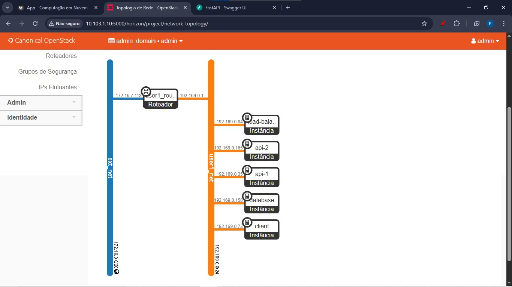
/// caption
Arquitetura de rede final
///

**Tarefa 4.3) Lista de VMs utilizadas com nome e IPs alocados,**

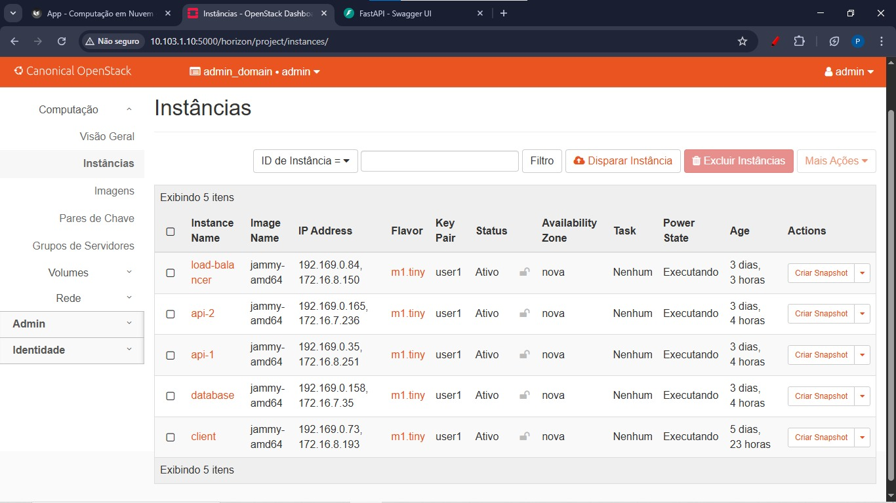
/// caption
Visualização dos nomes e IPs alocados via dashboard do Horizon
///

**Tarefa 4.4) Dashboard do FastAPI conectado via máquina Nginx/LB.**

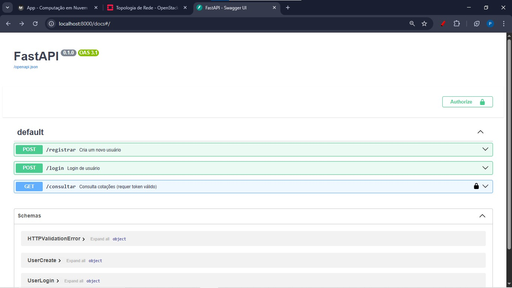
/// caption
Dashboard do FastAPI acessado após a aplicação do túnel SSH via máquina Nginx
///

**Tarefa 4.5) Servidores (máquina fisica) alocados para cada instância pelo OpenStack.**

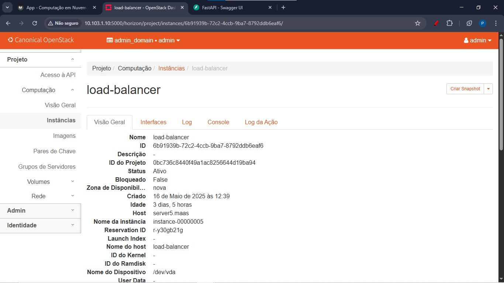
/// caption
Máquina física alocada para o Load Balancer pelo OpenStack: Server 5
///

/// caption
Máquina física alocada para a API 1 pelo OpenStack: Server 4
///
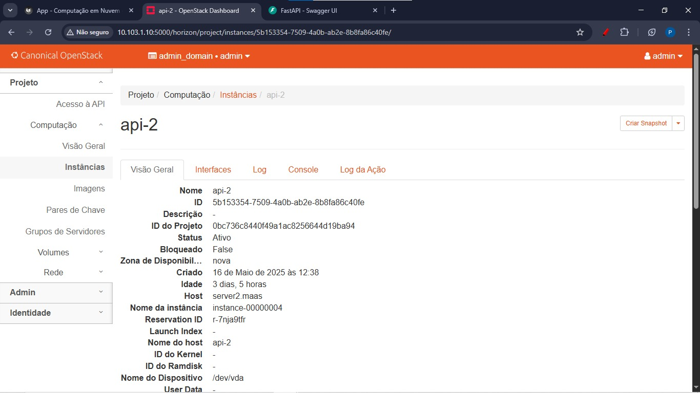
/// caption
Máquina física alocada para a API 2 pelo OpenStack: Server 2
///
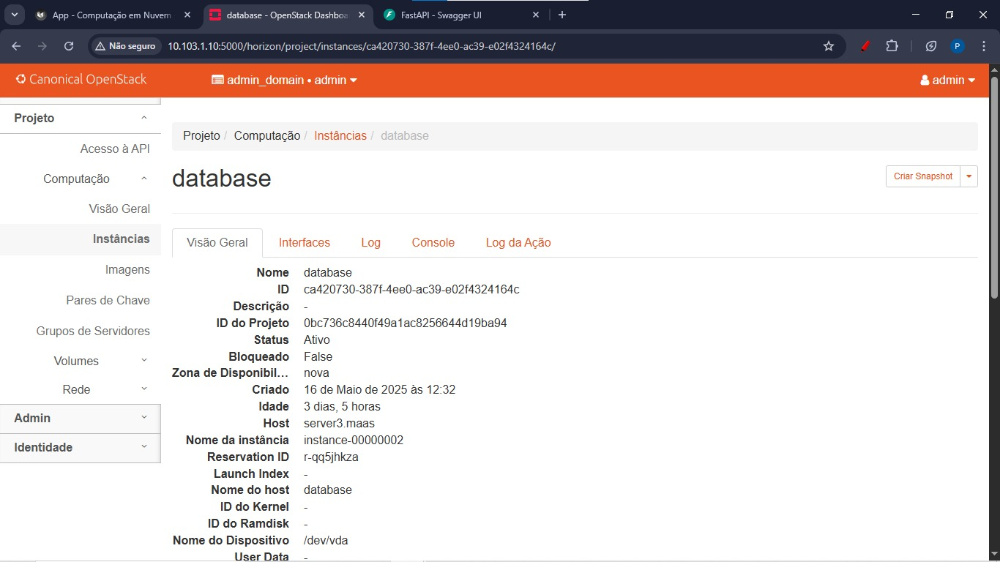
/// caption
Máquina física alocada para o Banco de dados Postgres pelo OpenStack: Server 3
///