## <b>Introdução e Objetivo</b>

<p align="justify">
O roteiro 4 contempla uma abordagem nova, mantendo a utlização do Juju para gerenciamento de aplicações distribuídas e o openstack implementado no roteiro anterio, mas explorando agora o conceito de Infraestrutura como código através do Terraform.
</p>

## <b>Montagem do Roteiro</b>

<p align="justify">
Todo roteiro apresenta uma primeira parte denominada <b>Infra</b> e uma segunda chamada de <b>App</b>.
Os pontos <b>tarefas</b> dentro de cada parte são os passos seguidos para a realização do roteiro. 
Este modelo de organização orientado por partes e tarefas será utilizado em <b>todos os roteiros</b>.
</p>

# <b>Infra</b>

<p align="justify">
Até o momento, foram utilizados o dashboard e a interface de linha de comando (CLI) para criar rede, subrede, instâncias, roteadorres e outros recursos. Para criar a infraestrutura necessária agora, conforme será visto mais a frente no App, foi utilizado somente código.
</p>

<p align="justify">
Primeiramente, para não confundir os recursos de cada usuário, foi criada uma separação lógica de dois usuários inseridos em um mesmo domínio (assim como deveria acontecer em nuvem): aluno1 e aluno2. 
</p>

## <b>Parte 1: Criando um único Domain</b>

<p align="justify">
Via Horizon Dashboard, foi criado o domínio AlunosDomain:
</p>

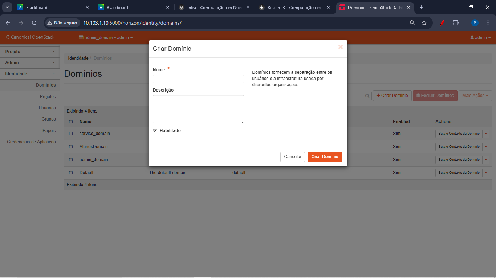
/// caption
Criação de domínio novo do Horizon Dashboard
///

<p align="justify">
Em seguida, o novo domínio criado foi definido como o novo contexto de uso, conforme mostra a imagem a seguir:
</p>

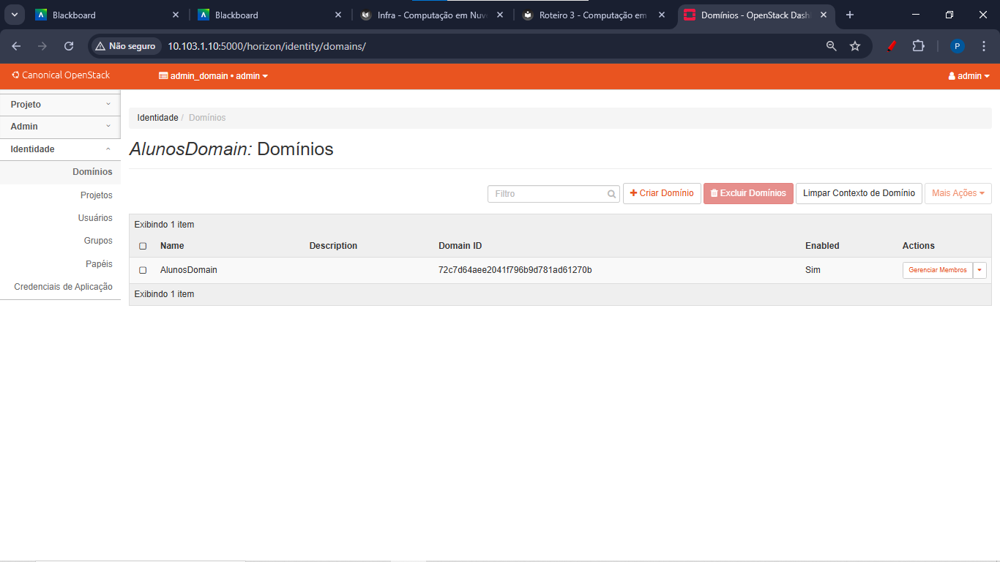
/// caption
Novo domínio como contexto de uso
///

## <b>Parte 2: Criando um projeto para cada Aluno</b>

<p align="justify">
Para separar o aluno1 do aluno2, foram feitos dois projetos que respeitassem o padrão Kit + letra do kit + nome_do_aluno.
</p>

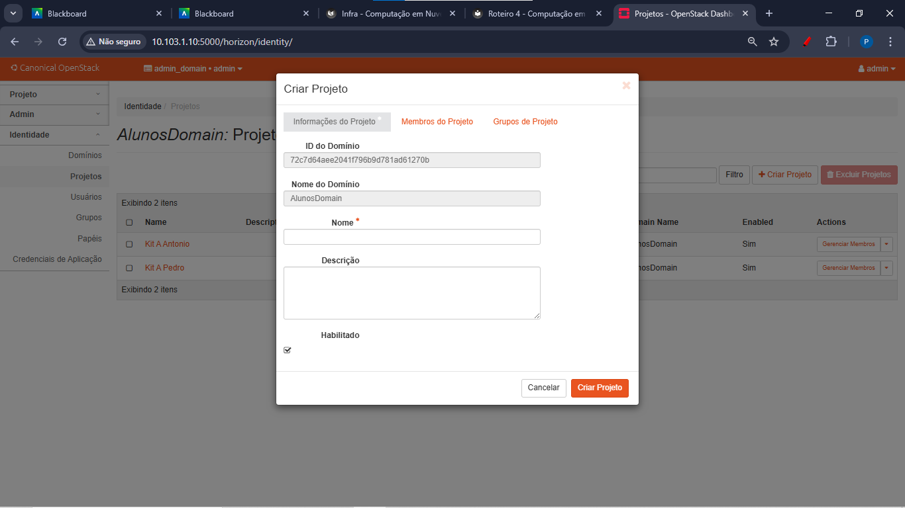
/// caption
Interface de criação dos projetos para cada usuário aluno
///

<p align="justify">
Por fim, os dois usuários foram criados também utilizando a interface do Horizon Dashboard, dando atenção especial para garantir que ambos tivessem papéis administrativos <b>tanto no momento de criação, quanto na configuração do domínio</b>. O domínio AlunosDomain e os respectivos projetos criados foram informados para cada um.
</p>

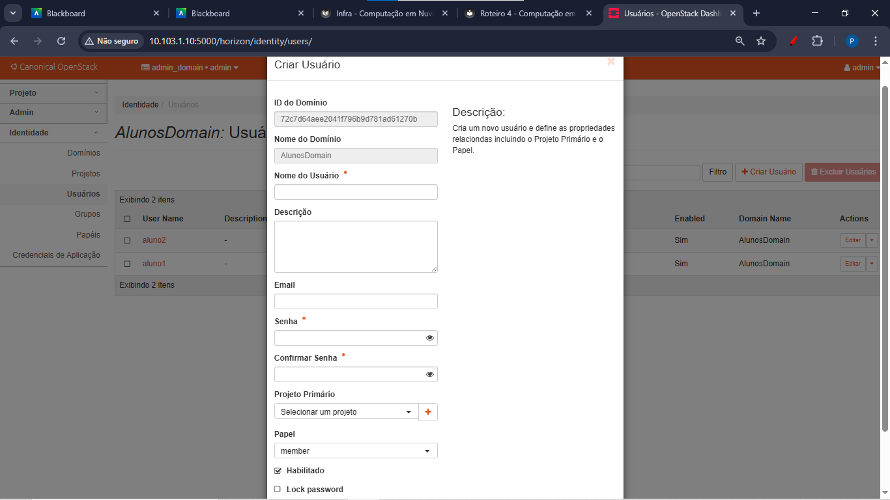
/// caption
Interface de criação dos usuários
///

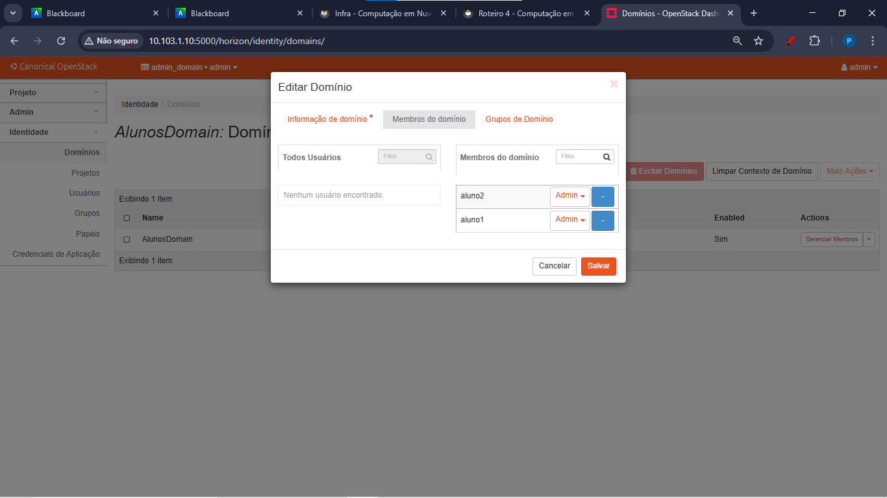
/// caption
Concedendo papel administrativo para ambos os usuários no domínio criado
///

# <b>App</b>

## <b>Parte 1: Criando arquivos do Terraform</b>

<p align="justify">
Utilizando a estrutura de pastas mostrada a seguir, cada aluno realizou a criação de sua própria infraestrutura em uma pasta própria (seguindo o padrão Kit + Letra do Kit + Primeiro Nome) dentro da máquina MAIN.
</p>


/// caption
Estrutura de pastas seguida por cada aluno na configuração do terraform
///

Os arquivos utilizados estão detalhados abaixo:

provider.tf
``` bash
# Define required providers
terraform {
required_version = ">= 0.14.0"
  required_providers {
    openstack = {
      source  = "terraform-provider-openstack/openstack"
      version = "~> 1.35.0"
    }
  }
}


# Configure the OpenStack Provider

provider "openstack" {
  region              = "RegionOne"
  user_name           = "SEU_USUARIO" # Aqui, alterou-se para aluno1/aluno2
}
```

instance1.tf

``` bash
resource "openstack_compute_instance_v2" "instancia_1" {
  name            = "basic"
  image_name      = "jammy-amd64" # Para saber a imagem adequada, acessamos Project > Compute > Images no Dashboard do Openstack
  flavor_name     = "m1.small"
  key_pair        = "mykey"
  security_groups = ["default"]

  network {
    name = "network_1" # Aqui, o nome da rede mudou de um aluno para outro
  }

  depends_on = [openstack_networking_network_v2.network_1]

}
```

instance2.tf

``` bash
resource "openstack_compute_instance_v2" "instancia_2" {
  name            = "basic2"
  image_name      = "jammy-amd64" # Para saber a imagem adequada, acessamos Project > Compute > Images no Dashboard do Openstack
  flavor_name     = "m1.tiny"
  key_pair        = "mykey"
  security_groups = ["default"]

  network {
    name = "network_1" # Aqui, o nome da rede mudou de um aluno para outro
  }

  depends_on = [openstack_networking_network_v2.network_1]

}
```

network.tf

``` bash
resource "openstack_networking_network_v2" "network_1" {
  name           = "network_1" # Aqui, o nome da rede mudou de um aluno para outro
  admin_state_up = "true"
}

resource "openstack_networking_subnet_v2" "subnet_1" {
  network_id = "${openstack_networking_network_v2.network_1.id}"
  cidr       = "192.167.199.0/24"
}
```

router.tf

``` bash
resource "openstack_networking_router_v2" "router_1" {
  name                = "my_router"
  admin_state_up      = true
  external_network_id = <"ID_EXT_NETWORK"> # Aqui, foi utilizado o ID da rede externa, disponível no Dashboard do Openstack ou via CLI openstack
}

resource "openstack_networking_router_interface_v2" "int_1" {
  router_id = "${openstack_networking_router_v2.router_1.id}"
  subnet_id = "${openstack_networking_subnet_v2.subnet_1.id}"
}
```

<p align="justify">
<b>Importante: </b>
Além da criação desses arquivos, cada aluno precisou criar um par de chaves próprio (denominado de "mykey" nos arquivos relativos às instâncias), acessando o Dashboard do OpenStack em Project > Compute > Key Pairs > Create Key Pair.
</p>

## <b>Parte 2: Credenciais dos respectivos usuários</b>

<p align="justify"> 
Antes de aplicar as mudanças definidas nos arquivos Terraform, era necessário realizar um último passo: adicionar o arquivo de credenciais de cada usuário. Para isso, foi feito o download do arquivo OpenStack RC diretamente pelo Dashboard, no caminho <strong>Project → API Access</strong>, selecionando a opção <strong>"Download OpenStack RC File"</strong> para cada usuário (aluno1 e aluno2). 
</p>

<p align="justify"> 
Após o download, o conteúdo de cada arquivo foi copiado e salvo em um novo arquivo dentro do mesmo diretório dos demais, utilizando o padrão <code>openrc.sh</code>. Em seguida, foi atribuído permissão de execução com o comando <code>chmod +x arquivo.sh</code>. Por fim, as variáveis de ambiente foram carregadas executando <code>source arquivo.sh</code>, garantindo que as credenciais daquele usuário estejam ativas na sessão. 
</p>

## <b>Parte 3: Implementação e verificação da infraestrutura</b>

Para fazer a implementação da infraestrutura, foram executados, por fim, os comandos abaixo:

``` bash
terraform plan # Cria o plano de execução antes do Terraform aplicar as configurações feitas

terraform apply # Aplica as mudanças necessárias a partir do plano de execução
``` 

<p align="justify"> 
Com o intuito de verificar que tudo ocorreu normalmente após os comandos acima, ainda foi executado o comando <code>openstack server list</code>, que devolveu as duas instâncias criadas (para cada usuário):
</p>

``` bash
+--------------------------------------+-----------+--------+--------------------------+--------------------------+---------+
| ID                                   | Name      | Status | Networks                 | Image                    | Flavor  |
+--------------------------------------+-----------+--------+--------------------------+--------------------------+---------+
| a99cbd57-eb44-4c0f-a441-6feaf73a16a6 | basic2    | ACTIVE | network_1=192.167.199.11 | jammy-amd64              | m1.tiny |
| cd7a3480-5bd8-4d94-9746-deac0d3324a2 | basic     | ACTIVE | network_1=192.167.199.74 | jammy-amd64              | m1.small|
+--------------------------------------+-----------+--------+---------------------+--------------------------+--------------+
```

## <b>Parte 4: Checkpoint por usuário após a criação das instâncias</b>

**Tarefa 1) Prints do Dashboard do OpenStack para o usuário aluno1**

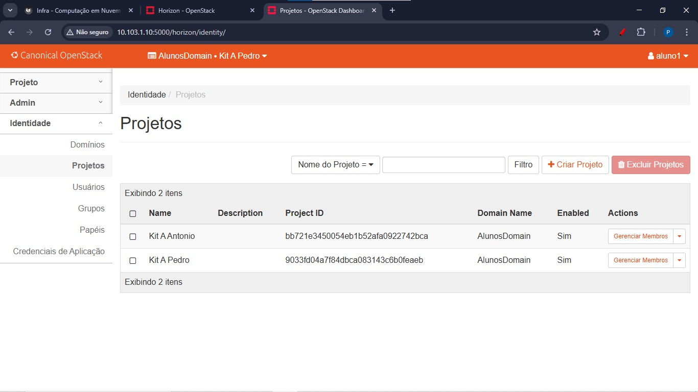
/// caption
Aba Identity (Identidade) > Projects (Projetos) do Dashboard do OpenStack para o aluno1 
///

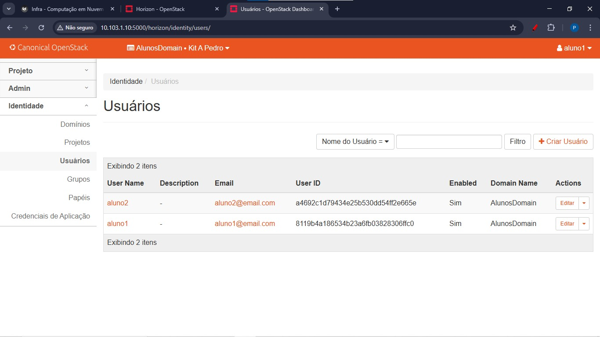
/// caption
Aba Identity (Identidade) > Users (Usuários) do Dashboard do OpenStack para o aluno1
///

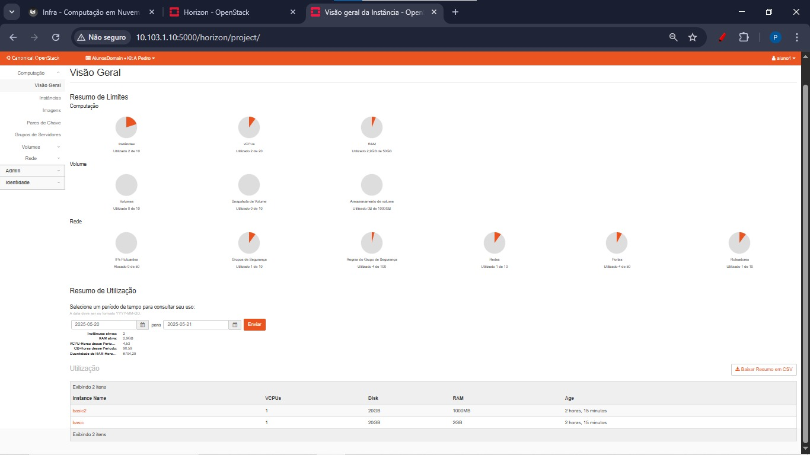
/// caption
Aba Compute (Computação) > Overview (Visão geral) do Dashboard do OpenStack para o aluno1
///

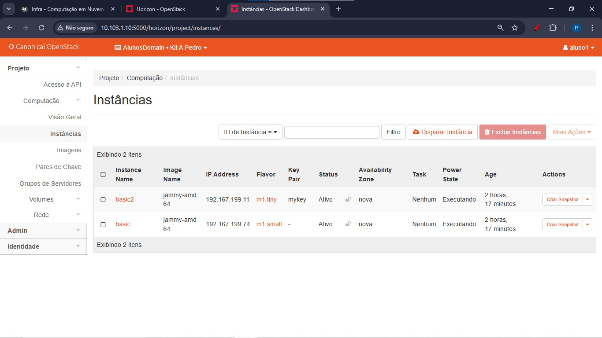
/// caption
Aba Compute (Computação) > Instances (Instâncias) do Dashboard do OpenStack para o aluno1
///

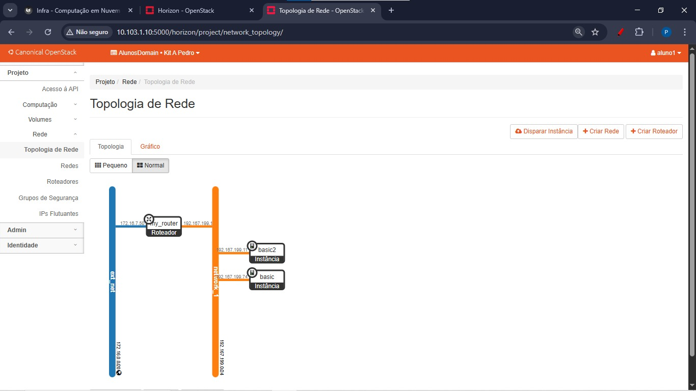
/// caption
Aba de Topologia de Rede (Network Topology) do Dashboard do OpenStack para o aluno1
///

----------------------------------------------------------------

**Tarefa 2) Prints do Dashboard do OpenStack para o usuário aluno2**

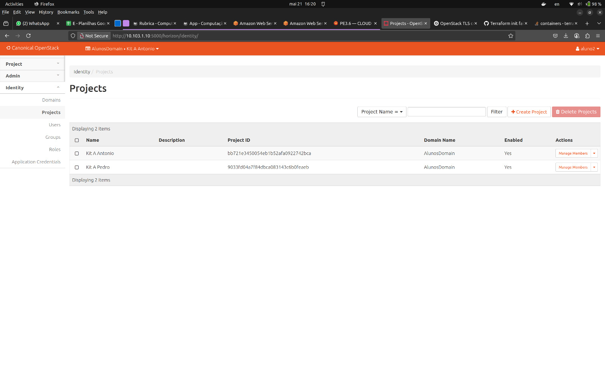
/// caption
Aba Identity (Identidade) > Projects (Projetos) do Dashboard do OpenStack para o aluno2 
///

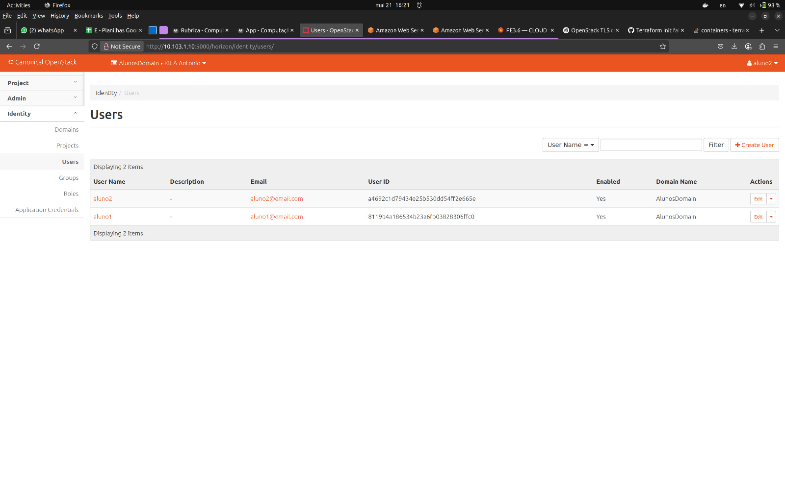
/// caption
Aba Identity (Identidade) > Users (Usuários) do Dashboard do OpenStack para o aluno2
///

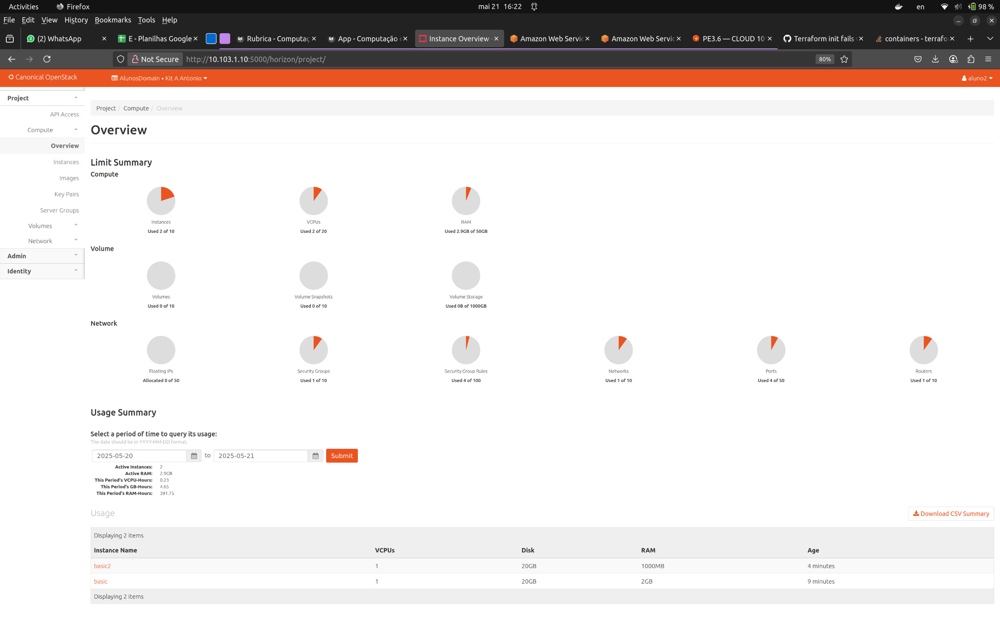
/// caption
Aba Compute (Computação) > Overview (Visão geral) do Dashboard do OpenStack para o aluno2
///

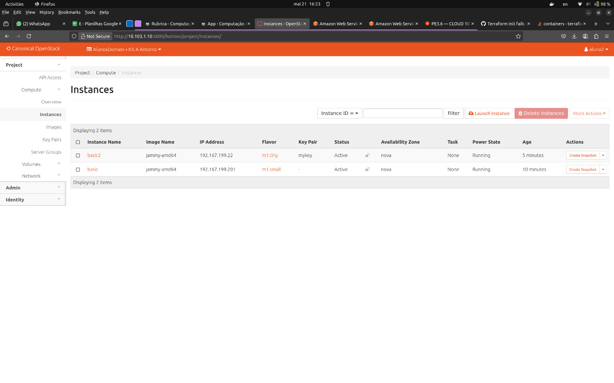
/// caption
Aba Compute (Computação) > Instances (Instâncias) do Dashboard do OpenStack para o aluno2
///

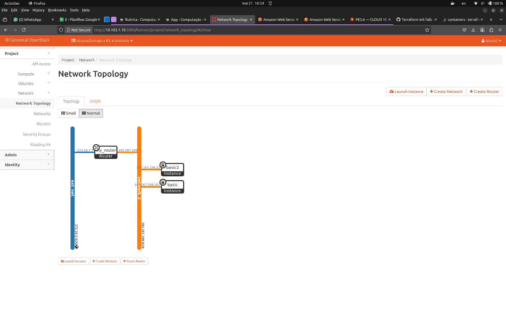
/// caption
Aba de Topologia de Rede (Network Topology) do Dashboard do OpenStack para o aluno2
///